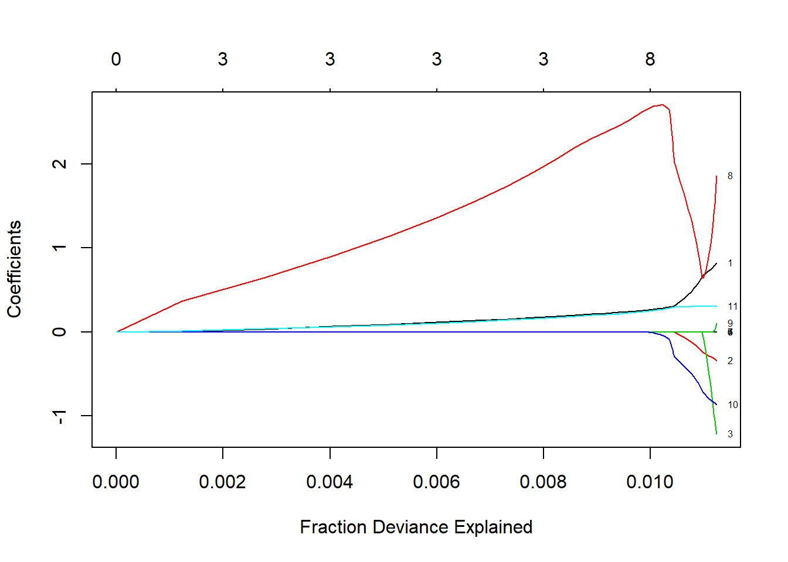
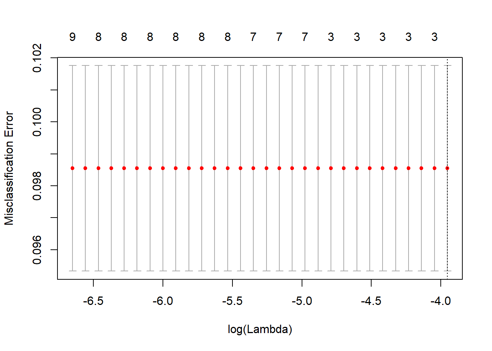

# Regression

```r
load("./save/BreastCancer.Rdata")

#import
Data_Purchase_Prediction <-read.csv("C:/Users/007/Desktop/Data science with R/R/Dataset/Chapter 6/PurchasePredictionDataset.csv",header=TRUE)

library(IDPmisc)
library(Metrics)
library(MASS)
library("lattice")
library(car)
```
## introduction
First supervized learning. Supervised learning means we have the (X,Y) and we need to get the function that maps X to Y. Dependante variable is available and regression use others predictives variables to estimate regression coefficient.

## Linear regression
  - **Model** :   $Y=\alpha + X \beta + \epsilon$
    * Linéaire: on suppose distribition normal
    * $\alpha$ :intercepte : la reponse moyenne si les variables explicatives sont zéro
    
  -  **Remarque**
    * Categorical data : set to as factor
    * Check Missing value : delete, impute, new catégorie
    
  - **Hypothèses** :
    - $rang(X) = p$ => Rang est connu, exclus la multicolinéarité
    - X est une matrice déterminée
    + $\epsilon$  sont des erreurs indépendantes
    + $E(\epsilon) = 0$ => erreur de moyenne nulle (normalité des résidus)
    + $var(\epsilon) = \sigma_2 In$ => variance Homoskédastique non autocorrélé  
    
    
  - **Estimation et propriétés des estimateurs** : Estimation par moindres carrés ordinaires : Minimise les squares error. Estimateur le plus efficace dans la classe des estimateurs non biaisé :BLUE
    * $E[Y] = X \beta$
    * $Var(Y) = \sigma In$ 
    * $E[\hat(\beta)] = \beta$
    * $var(\hat(\beta)) = \sigma (X'X)^(-1)$ 
    * Si $\epsilon ~ N(0, \sigma In)$, alors $\hat(\beta) ~ N(\beta, \sigma^2 (X'X)^(-1))$

$$SSTO = SSR + SSE$$
$$\sum{(Y_i - \bar{Y})^2} = \sum{(\hat{Y}_i - \bar{Y})^2} + \sum{(Y_i - \hat{Y})^2}$$

 - **Diagnostiques** : 
    +  **F-test**  : 
         + $H_0 : \beta_i = 0 \forall i$ 
         + stat de test  : $\frac{(SSTO - SSE)/(p-1)}{SSE/(n-p)} = \frac{MSR}{MSE} \sim F(p-1,n-1)$
    + **coefficient de détermination multiple $R^2$** : mesure de qualité d'ajustement 
          + $\frac{SSR/SSTO}$  

    - **Multicolinéarité** : forte corrélation entre variables explicatives
        - Conséquence : Interprétation des coéfficients impossibles
        - Diagnostiques : 
              + variance des coefficients très larges, 
              + coefficients varient beaucoup a l'ajouts/retrait de variables, 
              + coefficients ont signes non intruitifs
              + Calcule des VIF (variance inflation factor) : si mpoyenne des VIF > 1 ou un VIF >10)
                  + $tolérance = 1-R²$ et $VIF = \frac{1}{tolérance}$

        - Solution : Supprimer des variables, regression de Ridge (permet l'inversion de la matrice X'X qui est impossible en cas de multicolinéarité parfaite)
        
    - **Linéarité** : Graph des résidus Vs régresseurs
        + Si forme connue : transformer les regressieurs (log, sqrt) ou  ajouté un terme (quadratique, log, d'interaction,  ...)
    
    - **Homoskédasticité** : graph résidus vs valeurs prédites, test de Breush et Pagan, BreushPAgan, Berlett test, arch test
        + Variance des erreurs indépendante des variable explicative
        + Estimation reste correcte sous homoskédasticité : utilisé une variance corrigé : Régression de white
  
    -  **Erreur Non indépendante** : test d'autocorrélation  Dubin watson test, plot acf
        + If résidual show  definite relationship with prior résidual (like autocorrelation), the noise isn't random and we still have some information that we can extract and put in the model
        + Problème de modèle : passer en log lin, oubli de régresseur (qui est autocorrélé), inclure des lag de la variable dépendante
        
    - **Normalité des erreurs** : QQplot, test de Jarque Berra, KS test
        + estimation correcte mais interprétation des tests et des IC sont faussées car basé sur la normalité
        + théorie des grand nombre, si assez observations, estimateur OLS est assymptiquement normal et les test et IC tendent assymptotiquement

    -  **Influential Point Analysis**: Les valeurs abérantes peuvent crée des biais dans les estimateurs. Si trop extreme, on peut les deletes, check, impute, ...
        + DFFITS
        + DFBETAS
        + Distance de Cooks :   


$$ D_i = \frac{e²_i}{s²p} [\frac{h_i}{(1-h_i)²}]$$ 
where $s²= (n-p)^{-1}e^Te$ est la moyenne des erreurs quadratiques de la regression. Et $h_i =x^T(x^Tx)^{-1}$. Avec cutoff $D_i > 4/(n-k-1)$ ou k est le nombre de paramètre

Distance de Cook mesure l'effet of deleting a given observation. Si supprimer des observations cause grosse influence, alors ce point est suppiser etre outlier. 


 - **Evaluation** : 
    * RMSE = sqrt(mean($residuals)^2)  ou  $residuals = actual-predicted

- **Interprétation** : 
    -  Pour une augmentation de une unité de speed, dist augmente de 3.9324.
    -  Intercepte donne la dist si speed vaut zero


```r
reglin = lm(dist~ speed, data=cars)
summary(reglin)
```

```
## 
## Call:
## lm(formula = dist ~ speed, data = cars)
## 
## Residuals:
##     Min      1Q  Median      3Q     Max 
## -29.069  -9.525  -2.272   9.215  43.201 
## 
## Coefficients:
##             Estimate Std. Error t value Pr(>|t|)    
## (Intercept) -17.5791     6.7584  -2.601   0.0123 *  
## speed         3.9324     0.4155   9.464 1.49e-12 ***
## ---
## Signif. codes:  0 '***' 0.001 '**' 0.01 '*' 0.05 '.' 0.1 ' ' 1
## 
## Residual standard error: 15.38 on 48 degrees of freedom
## Multiple R-squared:  0.6511,	Adjusted R-squared:  0.6438 
## F-statistic: 89.57 on 1 and 48 DF,  p-value: 1.49e-12
```

```r
y =  cars$dist
x = cars$speed

res <-stack(data.frame(Observed = y, Predicted=fitted(reglin)))
res <-cbind(res, x =rep(x, 2))
#Plot using lattice xyplot(function)
library("lattice")
xyplot(values ~x, data = res, group = ind, auto.key =TRUE)
```


```r
sqrt(mean(residuals(reglin)^2))
```

```
## [1] 15.06886
```

```r
rmse(cars$dist,predict(reglin))
```

```
## [1] 15.06886
```

```r
# Normalité des résidus

sresid = studres(reglin)
sresid=NaRV.omit(sresid)
hist(sresid, freq=FALSE, main="Distribution of Studentized Residuals",breaks=25)
xfit<-seq(min(sresid),max(sresid),length=40)
yfit<-dnorm(xfit)
lines(xfit, yfit)
```


```r
## ADD QQplot
## test normalité (attention juste indicateur)
ks.test(reglin$residuals,pnorm,alternative="two.sided")
```

```
## 
## 	One-sample Kolmogorov-Smirnov test
## 
## data:  reglin$residuals
## D = 0.49833, p-value = 3.283e-11
## alternative hypothesis: two-sided
```

```r
shapiro.test(reglin$residuals)
```

```
## 
## 	Shapiro-Wilk normality test
## 
## data:  reglin$residuals
## W = 0.94509, p-value = 0.02152
```

```r
# Multicolinnéarité  : VIF 
# vif(reglin)

# residual autocorrelation : H0 = pas d'autocorrélation 
durbinWatsonTest(reglin)
```

```
##  lag Autocorrelation D-W Statistic p-value
##    1       0.1604322      1.676225    0.19
##  Alternative hypothesis: rho != 0
```

```r
plot(acf(reglin$residuals))
```


```r
# Homoskédasticité : breush pagan test
# h0 : variance hétéscedastic
ncvTest(reglin)
```

```
## Non-constant Variance Score Test 
## Variance formula: ~ fitted.values 
## Chisquare = 4.650233    Df = 1     p = 0.03104933
```

```r
#plot resi vs fit  : detect non liearité, heterocedasticity, outlier
# if random = ok
plot(reglin$residuals,reglin$fitted.values)
```


```r
# cook's distance

cutoff <-4/((nrow(cars)-length(reglin$coefficients)-1))
plot(reglin, which=4, cook.levels=cutoff)
```


```r
# taille du cercle proportionnel a la distance de cook
influencePlot(reglin, id.method="identify",main="Influence Plot", sub="Circle size is proportional to Cook's Distance", id.location=NULL)
```


```r
outlierTest(reglin)
```

```
## 
## No Studentized residuals with Bonferonni p < 0.05
## Largest |rstudent|:
##    rstudent unadjusted p-value Bonferonni p
## 49 3.184993          0.0025707      0.12853
```

```r
# now investigate vs mean of data variable
```


## ANOVA
## Polynomiale regression
Si la relation entre variables explicatives et variable dépendante n'est pas linéaire. Possibilité d'augmenter la relation dans des haut degré polynomials mais will cause overfitting. 
$$ y_i = \alpha_0 + \alpha_i x_i + \alpha_2 x²_i+ ... + \epsilon_i$$


  - Exemple :    
      - Dependant variable = price of a commodity  
      - Explicative variable = quantiée vendue
The general principle is if the price is too cheap, people will not buy the commodity thinking it's not of good quality, but if the price is too high, people will not buy due to cost consideration. Let's try to quantify this relationship using linear and quadratic regression  


```r
y <-as.numeric(c("3.3","2.8","2.9","2.3","2.6","2.1","2.5","2.9","2.4","3.0","3.1","2.8","3.3","3.5","3"))
x<-as.numeric(c("50","55","49","68","73","71","80","84","79","92","91","90","110","103","99"));

linear_reg <-lm(y~x)
summary(linear_reg)
```

```
## 
## Call:
## lm(formula = y ~ x)
## 
## Residuals:
##      Min       1Q   Median       3Q      Max 
## -0.66844 -0.25994  0.03346  0.20895  0.69004 
## 
## Coefficients:
##             Estimate Std. Error t value Pr(>|t|)    
## (Intercept) 2.232652   0.445995   5.006  0.00024 ***
## x           0.007546   0.005463   1.381  0.19046    
## ---
## Signif. codes:  0 '***' 0.001 '**' 0.01 '*' 0.05 '.' 0.1 ' ' 1
## 
## Residual standard error: 0.3836 on 13 degrees of freedom
## Multiple R-squared:  0.128,	Adjusted R-squared:  0.06091 
## F-statistic: 1.908 on 1 and 13 DF,  p-value: 0.1905
```

```r
plot(y)
lines(linear_reg$fitted.values)
```


```r
quad_reg <-lm(y~x +I(x^2) )
summary(quad_reg)
```

```
## 
## Call:
## lm(formula = y ~ x + I(x^2))
## 
## Residuals:
##      Min       1Q   Median       3Q      Max 
## -0.43380 -0.13005  0.00493  0.20701  0.33776 
## 
## Coefficients:
##               Estimate Std. Error t value Pr(>|t|)    
## (Intercept)  6.8737010  1.1648621   5.901 7.24e-05 ***
## x           -0.1189525  0.0309061  -3.849  0.00232 ** 
## I(x^2)       0.0008145  0.0001976   4.122  0.00142 ** 
## ---
## Signif. codes:  0 '***' 0.001 '**' 0.01 '*' 0.05 '.' 0.1 ' ' 1
## 
## Residual standard error: 0.2569 on 12 degrees of freedom
## Multiple R-squared:  0.6391,	Adjusted R-squared:  0.5789 
## F-statistic: 10.62 on 2 and 12 DF,  p-value: 0.002211
```

```r
plot(y)
lines(quad_reg$fitted.values)
```


```r
# improvement in R square, quadratic term significant
```


## Logistique
### General
 - **Variable dépendante binaire** : binomially distribued
binomial distribution probability mass function : $f(k;n,p) = P(X=k) = \left( \begin{array}{c} n \\ k \end{array} \right) p^k (1-p)^{n-k}$

- **Trois classe de modèle logistiques**: 
    - 1. binomial logistic regression : var dépendante soit 0 soit 1
    - 2. multinomial logistic regression : 3 ouplus niveu pour la variable dépendante (on utilise ditribution multinomiale)
    - 3. ordered logistic regression

- **Transformation logit** :  fonction de lien pour la regression : $logit = \frac{e^t}{e^t+1}=\frac{1}{1+e^{-t}}$

- **LA cote** :  représente la relation entre presence/absence d'un event
    - odd = P(A)/(1-P(A))
    - un odd de 2 pour un event A mean l'event est deux fois plus probable qu'il se réalise que rien ne se réalise.
    - Odd Ratio : rapport des cotes = Odd(A) / Odd(B)
    - SI OR = 2 : Chanque que B se réalise sont deux fois suppérieur a celle de A

### Binomial Logistic MODEL

  - **Model** : 
$$ logit(p_i) = \ln(\frac{p_i}{1-p_i}) = \beta_0 + \beta X $$

  - **Hypothèses** :

  - **Estimation** par MLE ou  itérative avec optimisation du logLoss

  - **Diagnostiques** : 
      -  Si but est classification : check les predictions et classement
      -  Si but est analyse des coefficients : vérification des hypothèsese stat
          - **Wald test** : same a t-test in reg lin. Test sur les levels des variables sont individuellements significatifs.  Suit une distri chi-square. 
        
          - **pseudo R-square** :  Mesure la proportion de variance expliqué par le modele. Mesure la différence entre la déviance un model null et fitted. Calcul par le likelihood ratio :
$$R²_i  = \frac{D_{null} - D_{fitted}}{D_{null}}$$
ou D est la déviance : $ D = - 2ln \frac{LH fitted model}{LH saturated model}$

          - **Bivariate plot** : observed and predictied vs variable explicative.  Plot donne info sur comme le model sur comporte selon les différent niveau 

          - **Matrice de classification** : 
                  - Spécificity = combien de negatif le model prédit correctement
                  - sensitivity = combien de positif le model prédit correctement


```r
library(ggplot2)
```

```
## Warning: package 'ggplot2' was built under R version 3.3.3
```

```r
library(mlbench)
```

```
## Warning: package 'mlbench' was built under R version 3.3.3
```

```r
  BreastCancer$Cl.thickness = as.numeric(as.character(BreastCancer$Cl.thickness))
  BreastCancer$IsMalignant = ifelse( BreastCancer$Class== "benign", 0, 1)

  ggplot(data =BreastCancer, aes(x = Cl.thickness, y = IsMalignant)) +
    geom_jitter(height = 0.05, width = 0.3, alpha=0.4) +
    geom_smooth(method = "glm", method.args = list(family = "binomial"))
```


```r
reglog =  glm(IsMalignant ~ Cl.thickness, family = "binomial",
      data = BreastCancer)
summary(reglog)
```

```
## 
## Call:
## glm(formula = IsMalignant ~ Cl.thickness, family = "binomial", 
##     data = BreastCancer)
## 
## Deviance Residuals: 
##     Min       1Q   Median       3Q      Max  
## -2.1986  -0.4261  -0.1704   0.1730   2.9118  
## 
## Coefficients:
##              Estimate Std. Error z value Pr(>|z|)    
## (Intercept)  -5.16017    0.37795  -13.65   <2e-16 ***
## Cl.thickness  0.93546    0.07377   12.68   <2e-16 ***
## ---
## Signif. codes:  0 '***' 0.001 '**' 0.01 '*' 0.05 '.' 0.1 ' ' 1
## 
## (Dispersion parameter for binomial family taken to be 1)
## 
##     Null deviance: 900.53  on 698  degrees of freedom
## Residual deviance: 464.05  on 697  degrees of freedom
## AIC: 468.05
## 
## Number of Fisher Scoring iterations: 6
```

```r
table(BreastCancer$Class, ifelse(predict(reglog, BreastCancer) < 0.5, 0, 1))
```

```
##            
##               0   1
##   benign    453   5
##   malignant  94 147
```


### Multinomial Logistic Regression 
Variable dépendante a plus de une catégorie et suit une distribution multinomiale. On fait une regression logistic pour chaque classe et combine dans un seul equation sous contrainte que la somme des probabilités vallent 1. Estimation par iterative optimization of the LogLoss function. 

  - But : clairement de la classification. Deux méthode possible :   
      - Pick de highest probability : classe dans la classe qui a le plus haute probabilité par rapport au autres classe. Méthode soufre de la "Class imbalance probleme" (si les classes sont non equilibré, tendance à toujours assigner dans la plus grande classe)
      - Ratio of probabilities : prendre la ratio des probabilité prédite et la prior distribution and choisir la classe basé sur le plus haut ratio. Cette méthode normalise les probabilité par le ratio du prior pour réduire le biais liéà la distribution du pior 


```r
Data_Purchase<-na.omit(Data_Purchase_Prediction)
rownames(Data_Purchase)<-NULL
#Random Sample for easy computation
Data_Purchase_Model<-Data_Purchase[sample(nrow(Data_Purchase),10000),]
# prior distribution
table(Data_Purchase_Model$ProductChoice)
```

```
## 
##    1    2    3    4 
## 2186 3903 2936  975
```

```r
# multinomial model 
library(nnet)
mnl_model <-multinom (ProductChoice ~MembershipPoints +IncomeClass + CustomerPropensity +LastPurchaseDuration +CustomerAge +MartialStatus, data = Data_Purchase)
```

```
## # weights:  44 (30 variable)
## initial  value 672765.880864 
## iter  10 value 615285.850873
## iter  20 value 607471.781374
## iter  30 value 607231.472034
## final  value 604217.503433 
## converged
```

```r
mnl_model
```

```
## Call:
## multinom(formula = ProductChoice ~ MembershipPoints + IncomeClass + 
##     CustomerPropensity + LastPurchaseDuration + CustomerAge + 
##     MartialStatus, data = Data_Purchase)
## 
## Coefficients:
##   (Intercept) MembershipPoints IncomeClass CustomerPropensityLow
## 2  0.77137077      -0.02940732  0.00127305            -0.3960318
## 3  0.01775506       0.03340207  0.03540194            -0.8573716
## 4 -1.15109893      -0.12366367  0.09016678            -0.6427954
##   CustomerPropensityMedium CustomerPropensityUnknown
## 2               -0.2745419                -0.5715016
## 3               -0.4038433                -1.1824810
## 4               -0.4035627                -0.9769569
##   CustomerPropensityVeryHigh LastPurchaseDuration CustomerAge
## 2                  0.2553831           0.04117902 0.001638976
## 3                  0.5645137           0.05539173 0.005042405
## 4                  0.5897717           0.07047770 0.009664668
##   MartialStatus
## 2  -0.033879645
## 3  -0.007461956
## 4   0.122011042
## 
## Residual Deviance: 1208435 
## AIC: 1208495
```

```r
# Modele converge en 30itérations.

#Predict the probabilities
predicted_test <-as.data.frame(predict(mnl_model, newdata = Data_Purchase, type="probs"))

## méthode 1 : the prediction based in highest probability
test_result <-apply(predicted_test,1,which.max)

result <-as.data.frame(cbind(Data_Purchase$ProductChoice,test_result))
colnames(result) <-c("Actual Class", "Predicted Class")
table(result$`Actual Class`,result$`Predicted Class`)
```

```
##    
##          1      2      3
##   1    302  91952  12365
##   2    248 150429  38028
##   3    170  90944  51390
##   4     27  32645  16798
```

```r
# bon résultat pour classe 123 mais pour classe 4 pas un seul case de classé. 

## Methode 2 : normalisation avec la ditribution du prior
prior <-table(Data_Purchase_Model$ProductChoice)/nrow(Data_Purchase_Model)
prior_mat <-rep(prior,nrow(Data_Purchase_Model))
pred_ratio <-predicted_test/prior_mat

test_result <-apply(pred_ratio,1,which.max)

result <-as.data.frame(cbind(Data_Purchase$ProductChoice,test_result))
colnames(result) <-c("Actual Class", "Predicted Class")
table(result$`Actual Class`,result$`Predicted Class`)
```

```
##    
##          1      2      3      4
##   1  22444  62943  19204     28
##   2  29614 110375  48633     83
##   3  14668  76304  51467     65
##   4   4871  27609  16940     50
```


## Generalized Linear Models
Pour GLM, on suppose que la variable dépendante est issue de la famille de ditribution exponentielle incluant la normal, binomial, poisson, gamma, ... etc. 
$$ E(Y) = \mu = g^{-1}(X\beta) $$
In R :  glm(formula, family=familytype(link=linkfunction), data=) 
    - binomial, (link = "logit")  : modele logistique
    - gaussian, (link= "identity") : modèle linéaire
    - Gamma, (link= "inverse") : analyse de survie (time to failure of a machine in the industry)
    - poisson, (link = "log") : How many calls will the call center receive today?
    
  
## Model Selection 
    - **Stepwise** : ajoute séquentielement la variables la plus significative. Après chaqeu ajout,le modèle réévalue la significativité des autres variables. Step : Model with 1 best feature, add next variables that maximise the evaluation function, ... Proc?dure tr?s lourde. parfois necessaire d'utiliser FIlter m?thod avant.


```r
### Data prep ###
#################

## Data with best feature from Filter method
data = get(load("C:/Users/007/Desktop/Data science with R/R/Dataset/LoanDefaultPred.RData"))
data[,"default"]=ifelse(data$loss ==0, 0,1)

data_model <-na.omit(data[,c("id","f338","f422","f724","f636","f775","f222","f93","f309","f303","f113","default"),])

### Forward ###
###############
full_model <-glm(default ~f338 +f422 +f724 +f636 +f775 +f222 +f93 +f309+f303
                 +f113,data=data_model,family=binomial(link="logit"))

null_model <-glm(default ~1 ,data=data_model,family=binomial(link="logit"))

forwards <-step(null_model,scope=list(lower=formula(null_model),upper=formula(full_model)), direction="forward")
```

```
## Start:  AIC=11175.3
## default ~ 1
## 
##        Df Deviance   AIC
## + f422  1    11136 11140
## + f113  1    11150 11154
## + f222  1    11150 11154
## + f775  1    11165 11169
## + f93   1    11168 11172
## + f309  1    11171 11175
## + f303  1    11171 11175
## <none>       11173 11175
## + f636  1    11172 11176
## + f338  1    11173 11177
## + f724  1    11173 11177
## 
## Step:  AIC=11140.24
## default ~ f422
## 
##        Df Deviance   AIC
## + f113  1    11113 11119
## + f222  1    11114 11120
## + f775  1    11129 11135
## + f93   1    11131 11137
## <none>       11136 11140
## + f303  1    11135 11141
## + f309  1    11135 11141
## + f636  1    11135 11141
## + f338  1    11136 11142
## + f724  1    11136 11142
## 
## Step:  AIC=11118.59
## default ~ f422 + f113
## 
##        Df Deviance   AIC
## + f222  1    11096 11104
## + f775  1    11106 11114
## <none>       11113 11119
## + f93   1    11111 11119
## + f303  1    11112 11120
## + f636  1    11112 11120
## + f309  1    11112 11120
## + f338  1    11112 11120
## + f724  1    11113 11121
## 
## Step:  AIC=11103.78
## default ~ f422 + f113 + f222
## 
##        Df Deviance   AIC
## + f775  1    11090 11100
## <none>       11096 11104
## + f303  1    11095 11105
## + f636  1    11095 11105
## + f309  1    11095 11105
## + f93   1    11095 11105
## + f338  1    11096 11106
## + f724  1    11096 11106
## 
## Step:  AIC=11099.57
## default ~ f422 + f113 + f222 + f775
## 
##        Df Deviance   AIC
## + f303  1    11087 11099
## <none>       11090 11100
## + f309  1    11088 11100
## + f636  1    11089 11101
## + f93   1    11089 11101
## + f338  1    11090 11102
## + f724  1    11090 11102
## 
## Step:  AIC=11098.6
## default ~ f422 + f113 + f222 + f775 + f303
## 
##        Df Deviance   AIC
## <none>       11087 11099
## + f636  1    11086 11100
## + f93   1    11086 11100
## + f309  1    11086 11100
## + f338  1    11086 11100
## + f724  1    11087 11101
```

```r
#best model with AIC criteria
formula(forwards)
```

```
## default ~ f422 + f113 + f222 + f775 + f303
```

    


## Regularization Algorithms
### Ridge regression
### Least Absolute Shrinkage and Selection Opérator LASSO
### Elastic Net
### Leas-Angle Regression LARS
     - **Lasso**
dd penalty term against the complexity to reduce the degree of overfittingor the variance of the model by adding additional bas.

Check formul LASSO

Objective function for the penalized logistic regression:
$ \min - [1/N \sum y (\beta_0 + x^T_t \beta) - \log(1 + \exp{(\beta_0 + x^T_t \beta)}) ] + lambda[(1-\alpha)||\beta||^2_2 ]$


```r
library("glmnet")

### Data prep ###
#################
data = get(load("C:/Users/007/Desktop/Data science with R/R/Dataset/LoanDefaultPred.RData"))
data[,"default"]=ifelse(data$loss ==0, 0,1)

data_model <-na.omit(data)
y <-as.matrix(data_model$default)
# x <-as.matrix(subset(data_model, select=continuous[250:260]))
x <-as.matrix(data_model[,250:260])

fit =glmnet(x,y, family="binomial")
summary(fit)
```

```
##            Length Class     Mode     
## a0          52    -none-    numeric  
## beta       572    dgCMatrix S4       
## df          52    -none-    numeric  
## dim          2    -none-    numeric  
## lambda      52    -none-    numeric  
## dev.ratio   52    -none-    numeric  
## nulldev      1    -none-    numeric  
## npasses      1    -none-    numeric  
## jerr         1    -none-    numeric  
## offset       1    -none-    logical  
## classnames   2    -none-    character
## call         4    -none-    call     
## nobs         1    -none-    numeric
```

```r
plot (fit, xvar="dev", label=TRUE)
```



```r
#Fit a cross validated binomial model
fit_logistic =cv.glmnet(x,y, family="binomial", type.measure="class")

plot (fit_logistic)
```



```r
# on est sens? voir un tendance dans les points rouge. on veut le labda qui minimum le taux de mauvaise classifications

print(fit_logistic$lambda.min)
```

```
## [1] 0.01919422
```

```r
param <-coef(fit_logistic, s="lambda.min")

param <-as.data.frame(as.matrix(param))
param$feature<-rownames(param)
#The list of variables suggested by the embedded method
param_embeded <-param[param[,2]>0,]
param_embeded
```

```
##      1 feature
## f251 0    f251
## f252 0    f252
## f253 0    f253
## f254 0    f254
## f255 0    f255
## f256 0    f256
## f257 0    f257
## f258 0    f258
## f259 0    f259
## f260 0    f260
## f261 0    f261
```
      
      
  - **ridge**
    
## Locally estimated Scaterplot Smoothing (LOESS)
