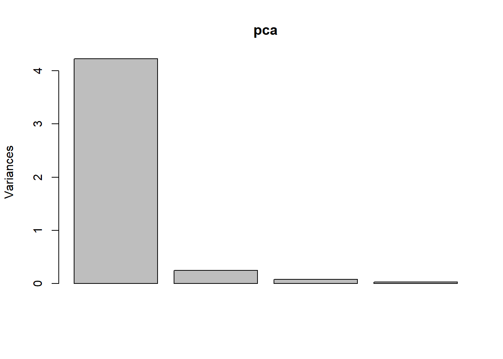
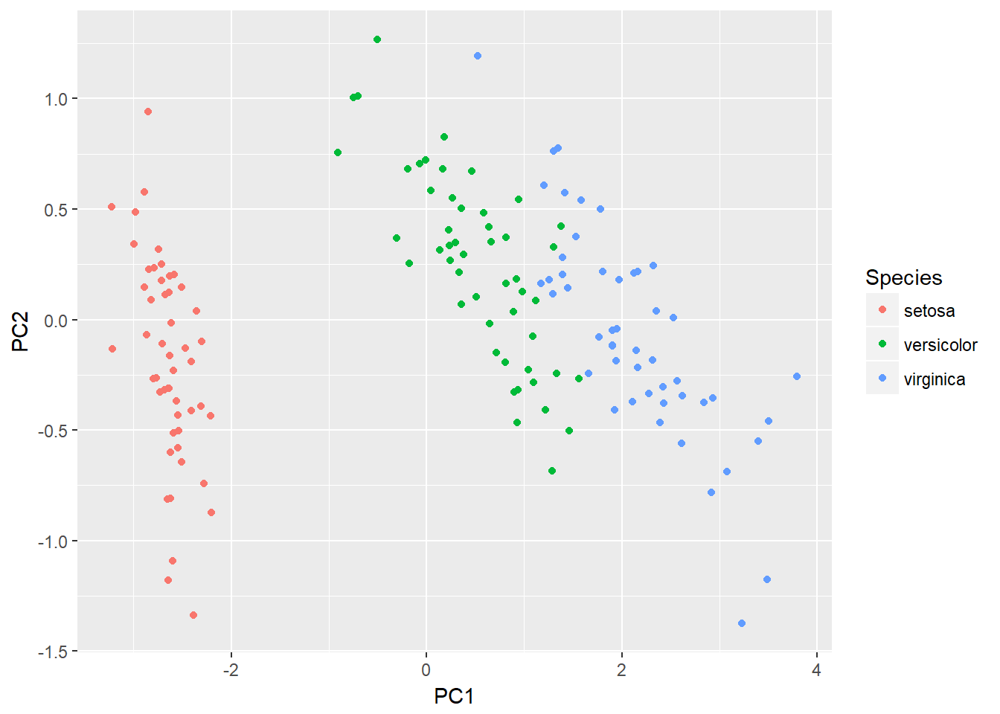
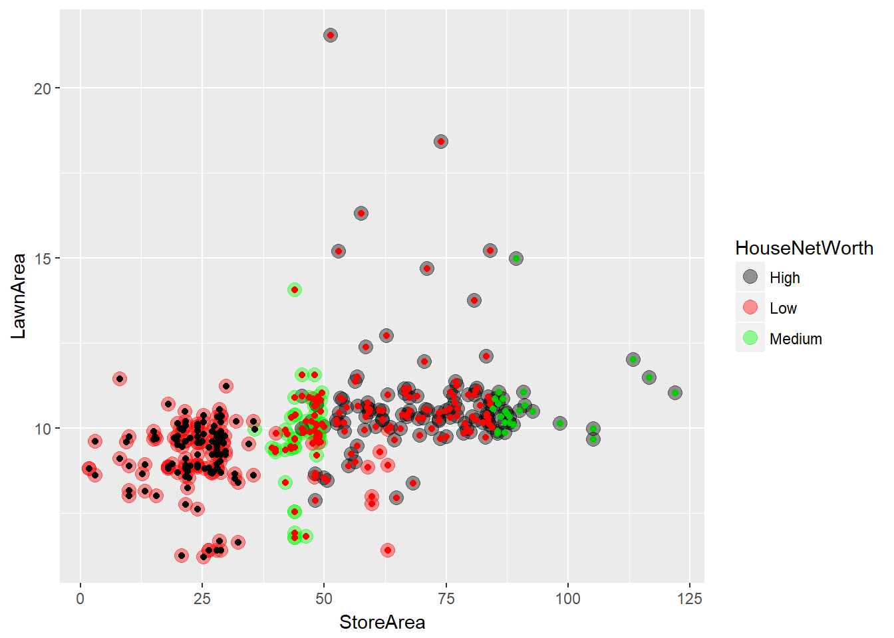
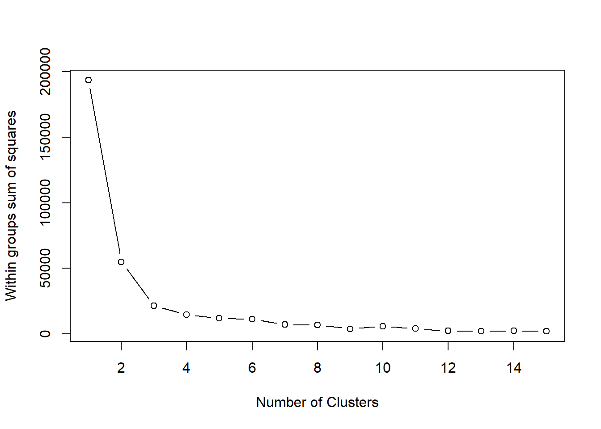
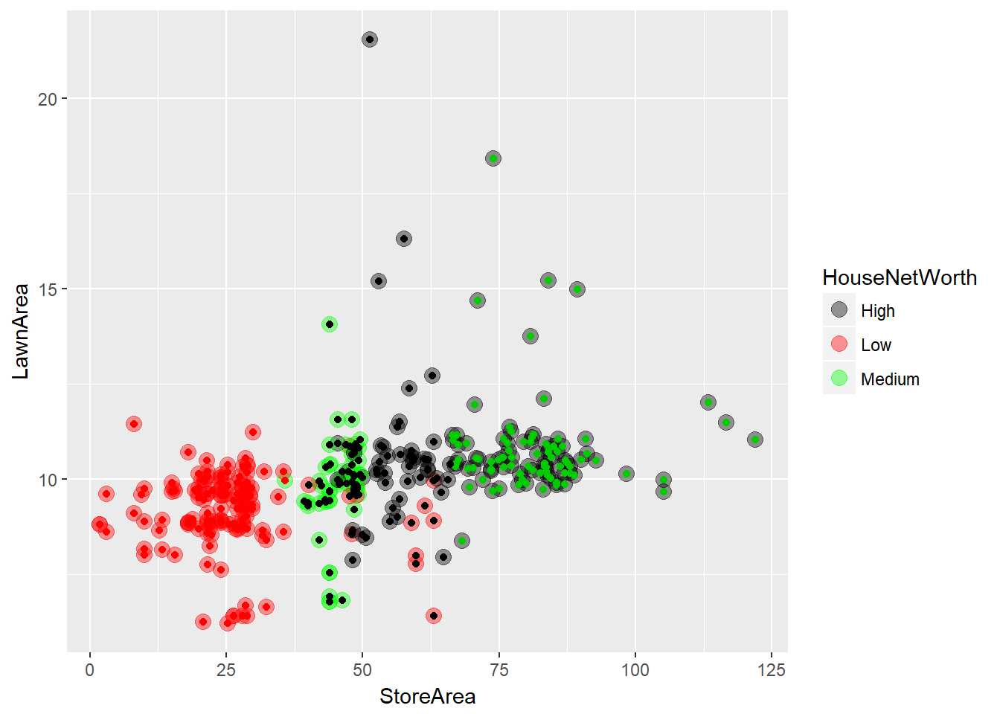

# Unsupervised


> Pas de variable dépendante, découverte des données

## Dimensionality reduction algorithms
  - **PCA**
L'objectif est de réduire la dimension des données pour obtenir une meilleur visualisation. PCA is a transformation  of the data but don't add or delete any information. 
    - Only numerical data, if factors :  transforme en vecteur numérique sinon use FDA
    - Hughes phenomeon : With a fixed number of training samples, the predictive power reduces as the dimensionality increases. 
    - But réduire la variabilité d'un dataset. On crée de nouvelles variables orthogonales qui explique le plus possible de variances des variables.
    - basé sur la matrice des covariances 


```r
pca <- prcomp(subset(iris, select = -Species))
pca
```

```
## Standard deviations:
## [1] 2.0562689 0.4926162 0.2796596 0.1543862
## 
## Rotation:
##                      PC1         PC2         PC3        PC4
## Sepal.Length  0.36138659 -0.65658877  0.58202985  0.3154872
## Sepal.Width  -0.08452251 -0.73016143 -0.59791083 -0.3197231
## Petal.Length  0.85667061  0.17337266 -0.07623608 -0.4798390
## Petal.Width   0.35828920  0.07548102 -0.54583143  0.7536574
```

```r
plot(pca)
```



```r
mapped_iris <- as.data.frame(predict(pca, iris))
mapped_iris <-cbind(mapped_iris, Species = iris$Species)

ggplot() +
geom_point(data=mapped_iris,aes(x = PC1, y = PC2, colour = Species))
```



```r
pca_data <-data[,c("f381","f408","f495","f529","f549","f539","f579","f634","f706","f743")]
pca_data <-na.omit(pca_data)

#Normalise the data before applying PCA analysis mean=0, and sd=1
scaled_pca_data <-scale(pca_data)

pca_results <-prcomp(scaled_pca_data)

plot(pca_results)
```


  
- **MCA**
- **principal component regression**
- **Partial least square regression**
supervised dimension reduction techniques use the response to guide the dimension reduction of the predictors such that the new predictors are optimally related to the response. Partial least squares (PLS) is a supervised version of PCA that reduces dimension in a way that is optimally related to the response. 
Specifically, the objective of PLS is to find linear functions (called latent variables) of the predictors that have optimal covariance with the response. This means that the response guides the dimension reduction such that the scores have the highest possible correlation with the response in the training data.

  - **Multidimendional scaling MDS**
  - **Linear discriminant Analysis LDA**
  - **Mixture discriminant Analysis MDA**
  - **Quadratic discriminant analysis QDA**
  - **Kernel Principal Component Analysis**
Principal component analysis is an effective dimension reduction technique when predictors are linearly correlated and when the resulting scores are associated with the response. However, the orthogonal partitioning of the predictor space may not provide a good predictive relationship with the response, especially if the true underlying relationship between the predictors and the response is non-linear
=> see scaterplot

  - **Non-negative Matrix Factorization**
linear projection method that is specific to features that are are positive or zero. In this case, the algorithm finds the coefficients of A
such that their values are also non-negative (thus ensuring that the new features have the same property). This approach is popular for text data where predictors are word counts, imaging, and biological measures

  - **Autoencodres**
Autoencoders are computationally complex multivariate methods for finding representations of the predictor data and are commonly used in deep learning models (Goodfellow, Bengio, and Courville 2016). The idea is to create a nonlinear mapping between the original predictor data and a set artificial features. One situation to use an autoencoder is when there is an abundance of unlabeled data

## Cluster analysis
Group data in most homegenous group. Clustering toujours la même chose, le truc qui change est la metrique. Différent type de clustering :
      - Connectivity models : Distance connectivity between observations is the measure, e.g., hierarchical clustering.
     - Centroid models : Distance from mean value of each observation/cluster is the measure, e.g., k-means.
     - Distribution models : Significance of statistical distribution of variables in the dataset is the measure, e.g., expectation maximization algorithms.
     - Density models: Density in data space is the measure, e.g., DBSCAN models.
     - Hard Clustering: Each object belongs to exactly one cluster
     - Soft Clustering : Each object has some likelihood of belonging to a different cluster

Remarque : pas de selection de variables dans le clustering, il faut porter de l'attention sur le dataset et les variables utilisées.

A good clustering algorithm can be evaluated based on two primary objectives:
     - High intra-class similarity
     - Low inter-class similarity
    
Choix de la mesure de similarité important


```r
# introduction to dataset
Data_House_Worth <-read.csv("C:/Users/007/Desktop/Data science with R/R/Dataset/Chapter 6/House Worth Data.csv",header=TRUE);
str(Data_House_Worth)
```

```
## 'data.frame':	316 obs. of  5 variables:
##  $ HousePrice   : int  138800 155000 152000 160000 226000 275000 215000 392000 325000 151000 ...
##  $ StoreArea    : num  29.9 44 46.2 46.2 48.7 56.4 47.1 56.7 84 49.2 ...
##  $ BasementArea : int  75 504 493 510 445 1148 380 945 1572 506 ...
##  $ LawnArea     : num  11.22 9.69 10.19 6.82 10.92 ...
##  $ HouseNetWorth: Factor w/ 3 levels "High","Low","Medium": 2 3 3 3 3 1 3 1 1 3 ...
```

```r
Data_House_Worth$BasementArea <-NULL

ggplot(Data_House_Worth, aes(StoreArea, LawnArea, color = HouseNetWorth))+geom_point()
```


   - **Hierarchical Clustering**
Chaque data sont dans un cluster. Les clusters sont aggrégé hiérachiquement en fonction d'une distance la plus faible jusqu'au moment ou il ne reste qu'un cluster. Hierarchical clustering is based on the connectivity model of clusters. The steps involved in the clustering process are:
    - Start with N clusters,(i.e., assign each element to its own cluster).
    - Now merge pairs of clusters with the closest to other
    - Again compute the distance (similarities) and merge with closest one.
    - Repeat Steps 2 and 3 to exhaust the items until you get all data points in one cluster.
    - Chose cutoff at how many clusters you want to have.
    

```r
library(ggplot2)
library(ggdendro)
```

```
## Warning: package 'ggdendro' was built under R version 3.3.3
```

```r
# Hierachical clustering
clusters <-hclust(dist(Data_House_Worth[,2:3]))
#Plot the dendogram
plot(clusters)
```


```r
#create different number of cluster
clusterCut_2 <-cutree(clusters, 2)
#table the clustering distribution with actual networth
table(clusterCut_2,Data_House_Worth$HouseNetWorth)
```

```
##             
## clusterCut_2 High Low Medium
##            1  104 135     51
##            2   26   0      0
```

```r
clusterCut_3 <-cutree(clusters, 3)
table(clusterCut_3,Data_House_Worth$HouseNetWorth)
```

```
##             
## clusterCut_3 High Low Medium
##            1    0 122      1
##            2  104  13     50
##            3   26   0      0
```

```r
# ici choix du nombre cluster = 3 par hypothèse sur le business

ggplot(Data_House_Worth, aes(StoreArea, LawnArea, color = HouseNetWorth)) +
geom_point(alpha =0.4, size =3.5) +geom_point(col = clusterCut_3) +
scale_color_manual(values =c('black', 'red', 'green'))
```



```r
## Iris Example

 iris_dist <- dist(scale(subset(iris, select = -Species)))
 clustering <- hclust(iris_dist)
 plot(clustering)
```


```r
 ggdendrogram(clustering) + theme_dendro()
```


```r
 clusters = cutree(clustering,k = 3)
 
 data = cbind(mapped_iris, Cluster = clusters)
 
 ggplot() +
 geom_point(data= data, aes(x = PC1, y = PC2,
 shape = Species, colour = Cluster))
```


  -  **K-means clustering**  
  
K-means place observations into Kclusters by minimizing the wihtin-cluster sum of squares (WCSS). WCSS est la somme des distance entre chaque observation et le centre du cluster. Algorithm : 
    - Assignment: Assign each observation to the cluster that gives the minimum within cluster sum of squares (WCSS).
    - Update: Update the centroid by taking the mean of all the observation in the cluster.
    - These two steps are iteratively executed until the assignments in any two consecutive iteration don't change
  
To find the optimal value of k, we use and Elbow curve that show percentage of variance explained as a functionof nombrr of cluster  
  

```r
wss <-(nrow(Data_House_Worth)-1)*sum(apply(Data_House_Worth[,2:3],2,var))

for (i in 2:15) {
    wss[i]<-sum(kmeans(Data_House_Worth[,2:3],centers=i)$withinss)
                }

plot(1:15, wss, type="b", xlab="Number of Clusters",ylab="Within groups sum of squares")
```



```r
# 3 cluster explain most of the variance in data. 4cluster not more interest and not in concordance with intuition

# Model
Cluster_kmean <-kmeans(Data_House_Worth[,2:3], 3, nstart =20)
table(Cluster_kmean$cluster,Data_House_Worth$HouseNetWorth)
```

```
##    
##     High Low Medium
##   1   46  13     50
##   2    0 122      1
##   3   84   0      0
```

```r
Cluster_kmean$cluster <-factor(Cluster_kmean$cluster)

ggplot(Data_House_Worth, aes(StoreArea, LawnArea, color = HouseNetWorth)) + geom_point(alpha =0.4, size =3.5) +geom_point(col = Cluster_kmean$cluster) +scale_color_manual(values =c('black', 'red', 'green'))
```



```r
# Capture cluster very well
```


  - **Ditribution-based clustering**  
  
Distribution methods are iterative methods to fit a set of dataset into clusters by optimizing distributions of datasets in clusters (i.e. Gaussian distribution). 
    - First randomly choose Gaussian parameters and fit it to set of data points.
    - Iteratively optimize the distribution parameters to fit as many points it can.
    - Once it converges to a local minima, you can assign data points closer to that distribution of that cluster

=> Attention cette méthode souffre d'overfitting


```r
library(EMCluster, quietly =TRUE)
```

```
## Warning: package 'EMCluster' was built under R version 3.3.3
```

```r
#model
ret <-init.EM(Data_House_Worth[,2:3], nclass =3)
ret
```

```
## Method: em.EMRnd.EM
##  n = 316, p = 2, nclass = 3, flag = 0, logL = -1871.0408.
## nc: 
## [1] 170 100  46
## pi: 
## [1] 0.5576 0.2439 0.1985
```

```r
# assign class
ret.new <-assign.class(Data_House_Worth[,2:3], ret, return.all =FALSE)

plotem(ret,Data_House_Worth[,2:3])
```


```r
ggplot(Data_House_Worth, aes(StoreArea, LawnArea, color = HouseNetWorth)) +
geom_point(alpha =0.4, size =3.5) +geom_point(col = ret.new$class) +
scale_color_manual(values =c('black', 'red', 'green'))
```


```r
# good fort high and low.
```


  - **Density based clustering DBSCAN**
see more on Machine Learning Using R p 349

  -  **exemple avec Fuzzy C-Means Clustering**
This is the fuzzy version of the known k-means clustering algorithm as well as an online variant (Unsupervised Fuzzy Competitive learning). Observe that we are passing the value ucfl to the parameter method, which does an online update of model using Unsupervised Fuzzy Competitive Learning (UCFL). On suppose que les donn?es ce mettent a jours et a chaque nouvelle observation le modle s'update


```r
library(e1071)
```

```
## Warning: package 'e1071' was built under R version 3.3.3
```

```r
Data_House_Worth <-read.csv("C:/Users/007/Desktop/Data science with R/R/Dataset/Chapter 6/House Worth Data.csv",header=TRUE)

str(Data_House_Worth)
```

```
## 'data.frame':	316 obs. of  5 variables:
##  $ HousePrice   : int  138800 155000 152000 160000 226000 275000 215000 392000 325000 151000 ...
##  $ StoreArea    : num  29.9 44 46.2 46.2 48.7 56.4 47.1 56.7 84 49.2 ...
##  $ BasementArea : int  75 504 493 510 445 1148 380 945 1572 506 ...
##  $ LawnArea     : num  11.22 9.69 10.19 6.82 10.92 ...
##  $ HouseNetWorth: Factor w/ 3 levels "High","Low","Medium": 2 3 3 3 3 1 3 1 1 3 ...
```

```r
Data_House_Worth$BasementArea <-NULL


online_cmean <-cmeans(Data_House_Worth[,2:3],3,20,verbose=TRUE,
                      method="ufcl",m=2)
```

```
## Iteration:   1, Error: 115.4861275493
## Iteration:   2, Error: 111.6796778222
## Iteration:   3, Error: 108.2383922809
## Iteration:   4, Error: 105.1380167148
## Iteration:   5, Error: 102.3533642433
## Iteration:   6, Error: 99.8596417854
## Iteration:   7, Error: 97.6332760709
## Iteration:   8, Error: 95.6523863813
## Iteration:   9, Error: 93.8970191712
## Iteration:  10, Error: 92.3492290987
## Iteration:  11, Error: 90.9930658265
## Iteration:  12, Error: 89.8145069076
## Iteration:  13, Error: 88.8013634065
## Iteration:  14, Error: 87.9431754552
## Iteration:  15, Error: 87.2311085921
## Iteration:  16, Error: 86.6578575515
## Iteration:  17, Error: 86.2175614904
## Iteration:  18, Error: 85.9057329426
## Iteration:  19, Error: 85.7192017623
## Iteration:  20, Error: 85.6560747088
```

```r
# print(online_cmean)

ggplot(Data_House_Worth, aes(StoreArea, LawnArea, color = HouseNetWorth)) +
geom_point(alpha =0.4, size =3.5) +geom_point(col = online_cmean$cluster) +
scale_color_manual(values =c('black', 'red', 'green'))
```


## Evaluation of clustering
  - **Internal evaluation**
    - Dunn Index : the ratio between the minimal intercluster distances to the maximal intracluster distance. But high score
    - Silhouette Coefficient : the average distance to elements in the same cluster with the average distance to elements in other clusters. Objects with a high silhouette value are considered well clustered

- **external evaluation on test set**
    - Rand index :  similar to classification rate in multi-class classification problems. measures how many items that are returned by the cluster and expert (labeled) are common and how many differ. $RI = \frac{TP+TN}{TP/FP/FN/TN}$ (true positive, true negative,...)
    - Jaccard index : measures the overlap of external labels and labels generated by the cluster algorithms. The Jaccard index value varies between 0 and 1, 0 implying no overlap while 1 means identical datasets. $J= \frac{|A \cap B|}{|A \cup B|} = \frac{TP}{TP+FP+FN}
    


## Association Rule Mining Algorithms
Association rule learning is a method for discovering interesting relations between variables in large databases using some measures of interestingness. Pratique courante sur les transactional (supermarket, library,...). Pour mettre produit ensemble pourune promo, planning, customer segmentation, ...

  - Usefull measures : 
    - Support :  is the proportion of transactions in which an item set appears
    - Confidence :  indicates the strength of a rule. is the conditional probability $conf(X=>Y) = \frac{supp(X\cupY)}{supp(X)}
    - Lift :  is a ratio between the observed support to the expected support. If = 1 then independent.  $ Lift(X=>Y) = \frac{supp(X\cupY)}{supp(X)supp(Y)}

=> more information in  Beginning Data Science With R p 192 or Machine learning with R chap 6.10


## Singular Value decomposition
## K-Nearest Neighbot

## Others unsuppervised algorithms
  -  **Learning Vector Quantization**
  - **Self-Organizing MAP (SQM)**
  - **Partitioning around Medoids PAM**


