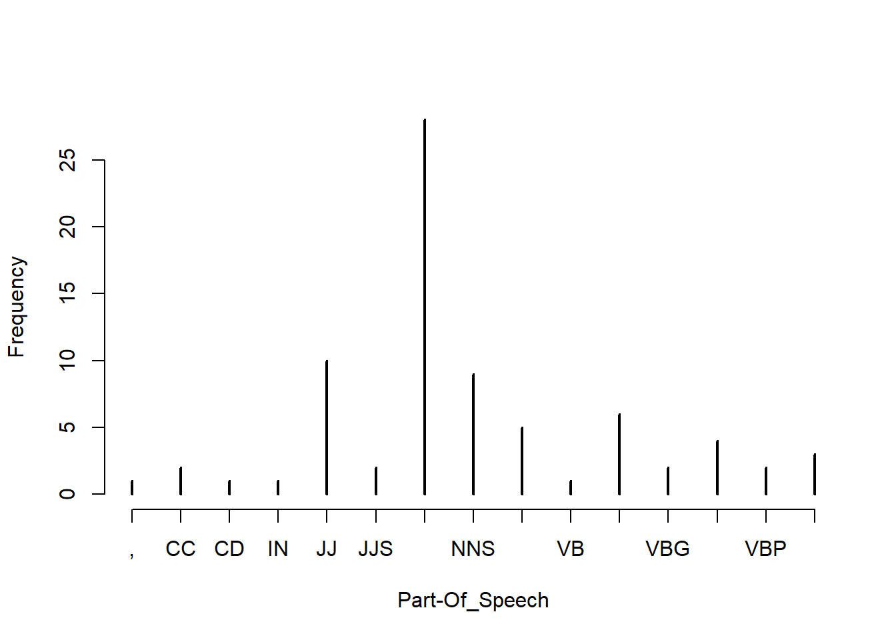
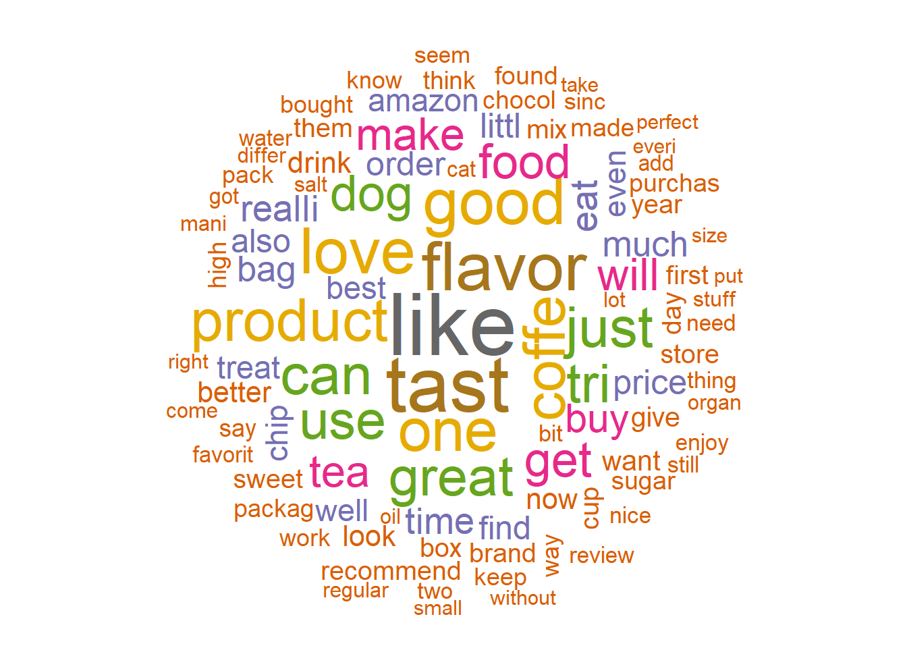

# Text Mining


  - To Read : 
    - https://www.tidytextmining.com/index.html
    - Natural language processing (NLP)

## TF - IDF 
  - Term frequency counts the number of occurrences of a term t in a document.
  - Inverse document frequency : $ idf = log_2 \frac{|D|}{|{d|t\in d}|} where |D| denotes the total number of documents and $|{d|t\in d}|$ is the number of documents where the term t appears
    

Certain terms that occur too frequently have little power in determining the reliance of a document. IDF weigh down the too frequently occurring word (et inverserment). A tf-idf matrix is a numerical representation of a collection of documents (represented by row) and words contained in it (represented by columns).   


  - **In bag-of-words (BoW) featurization**, a text document is converted into a flat vector of counts. In a bag-of-words vector, each word becomes a dimension of the vector. If there are n words in the vocabulary, then a document becomes a point1 in n-dimensional space. Instead of looking at the raw counts of each word in each document in a dataset, tf-idf looks at a normalized count where each word count is divided by the number of documents this word appears in : 
      - bow(w, d) = # times word w appears in document d
      - tf-idf(w, d) = bow(w, d) * log (N / # documents in which word w appears)


If a word appears in many 61documents, then its inverse document frequency is close to 1. If a word appears in just a few documents, then the inverse document frequency is much higher. Thus, tf-idf makes rare words more prominent and effectively ignores common words. It is closely related to the frequency-based filter‐ing methods

> Text Mining TM : USE bag of word each word one feature + PCA pour reduire dimension

  - **bag-of-n-grams** :   is a sequence of n tokens. After tokenization, the counting mechanism can collate individual tokens into word counts. n-grams retain more of the original sequence structure of the text.
    - For example, the sentence “Emma knocked on the door” generates the n-grams “Emma knocked,” “knocked on,” “on the,” and “the door. here are usually a lot more distinct n-grams (n > 1) than words. This means that bag-of-n-grams is a much bigger and sparser feature space. It also means that n-grams are more expensive to compute, store, and
model.

  -  **Filtering for Cleaner Features** : TM generate a lot a new feature, How separate the noise from the signal?
    - Stopword : For classification, the pronouns, articles, and prepositions may not add much value. The case may be very different in sentiment analysis, which requires a fine-grained understanding of semantics. 
    - Frequent words : Looking at the most frequent words can reveal parsing problems and highlight normally useful words that happen to appear too many times in the corpus 
    -  Rare words : To a statistical model, a word that appears in only one or two documents is more like noise than useful information. Over 60% of the vocabulary occurs rarely. This is a so-called heavy-tailed distribution, and it is very common in real-world data. The training time of many statistical machine learning models scales linearly with the number of features, and some models are quadratic or worse. Rare words incur a large computation and storage cost for not much additional gain
    - Stemming : Stemming is an NLP task that tries to chop each word down to its basic linguistic word stem form (“swimmer,” “swimming,” and “swim,”) =< lemmmization

> The right scaling accentuates the informative words and downweights the common words. It can also improve the condition number of the data matrix.

  
  - **Parsing and Tokenization**
    - Parsing is necessary when the string contains more than plain text. For instance, if the raw data is a web page, an email, or a log of some sort, then it contains additional structure
    -tokenization : This turns the string—a sequence of characters—into a sequence of tokens. Each token can then be counted as a word

  - **Chunking and part-of-speech tagging**
    - we tokenize each word with a part of speech and then examine the token’s neighborhood to look for part-of-speech groupings, or “chunks.”

  - **Part of Speech (POS) tagging**
    - This could help in classifying named entities in text into categories like persons, company, locations, expression of time, and so on.
 
  - **Word Cloud**
    - The word cloud helps in visualizing the words most frequently being used in the reviews
    
    


```r
library(data.table)
library(caTools)

fine_food_data <-read.csv("C:/Users/007/Desktop/Data science with R/R/Dataset/Chapter 6/Food_Reviews.csv", stringsAsFactors =FALSE)
fine_food_data$Score <-as.factor(fine_food_data$Score)

head(fine_food_data[,10],2)
```

```
## [1] "I have bought several of the Vitality canned dog food products and have found them all to be of good quality. The product looks more like a stew than a processed meat and it smells better. My Labrador is finicky and she appreciates this product better than  most."
## [2] "Product arrived labeled as Jumbo Salted Peanuts...the peanuts were actually small sized unsalted. Not sure if this was an error or if the vendor intended to represent the product as \"Jumbo\"."
```

```r
# Data preparation

# Randomly split data and use only 10% of the dataset
set.seed(90)
split =sample.split(fine_food_data$Score, SplitRatio =0.10)
fine_food_data =subset(fine_food_data, split ==TRUE)
select_col <-c("Id","HelpfulnessNumerator","HelpfulnessDenominator","Score","Summary","Text")
fine_food_data_selected <-fine_food_data[,select_col]

dim(fine_food_data_selected)
```

```
## [1] 3518    6
```

```r
# Summary text
##original
fine_food_data_selected[2,6]
```

```
## [1] "McCann's Instant Oatmeal is great if you must have your oatmeal but can only scrape together two or three minutes to prepare it. There is no escaping the fact, however, that even the best instant oatmeal is nowhere near as good as even a store brand of oatmeal requiring stovetop preparation.  Still, the McCann's is as good as it gets for instant oatmeal. It's even better than the organic, all-natural brands I have tried.  All the varieties in the McCann's variety pack taste good.  It can be prepared in the microwave or by adding boiling water so it is convenient in the extreme when time is an issue.<br /><br />McCann's use of actual cane sugar instead of high fructose corn syrup helped me decide to buy this product.  Real sugar tastes better and is not as harmful as the other stuff. One thing I do not like, though, is McCann's use of thickeners.  Oats plus water plus heat should make a creamy, tasty oatmeal without the need for guar gum. But this is a convenience product.  Maybe the guar gum is why, after sitting in the bowl a while, the instant McCann's becomes too thick and gluey."
```

```r
library(LSAfun)
genericSummary(fine_food_data_selected[2,6],k=1)
```

```
## [1] " There is no escaping the fact, however, that even the best instant oatmeal is nowhere near as good as even a store brand of oatmeal requiring stovetop preparation"
```

```r
genericSummary(fine_food_data_selected[2,6],k=2)
```

```
## [1] " There is no escaping the fact, however, that even the best instant oatmeal is nowhere near as good as even a store brand of oatmeal requiring stovetop preparation"
## [2] "  It can be prepared in the microwave or by adding boiling water so it is convenient in the extreme when time is an issue"
```

```r
# TF and IDF
library(tm)

fine_food_data_corpus <-VCorpus(VectorSource(fine_food_data_selected$Text))

## Standardize the text - Pre-Processing
fine_food_data_text_dtm <-DocumentTermMatrix(fine_food_data_corpus, 
                          control=list(tolower =TRUE,
                                       removeNumbers =TRUE,
                                       stopwords =TRUE,
                                       removePunctuation =TRUE,
                                       stemming =TRUE
                                       ))

#save frequently-appearing terms( more than 500 times) to a character vector
fine_food_data_text_freq <-findFreqTerms(fine_food_data_text_dtm, 500)

# create DTMs with only the frequent terms
fine_food_data_text_dtm <-fine_food_data_text_dtm[ , fine_food_data_text_freq]
tm::inspect(fine_food_data_text_dtm[1:5,1:10])
```

```
## <<DocumentTermMatrix (documents: 5, terms: 10)>>
## Non-/sparse entries: 8/42
## Sparsity           : 84%
## Maximal term length: 6
## Weighting          : term frequency (tf)
## Sample             :
##     Terms
## Docs also bag buy can coffe dog eat find flavor food
##    1    1   0   0   0     0   0   0    0      0    0
##    2    0   0   1   2     0   0   0    0      0    0
##    3    0   0   0   0     2   0   0    0      0    0
##    4    0   0   0   0     0   0   1    1      0    0
##    5    0   0   0   0     0   0   0    1      2    0
```

```r
#Create a tf-idf matrix
fine_food_data_tfidf <-weightTfIdf(fine_food_data_text_dtm, normalize=FALSE)
tm::inspect(fine_food_data_tfidf[1:5,1:10])
```

```
## <<DocumentTermMatrix (documents: 5, terms: 10)>>
## Non-/sparse entries: 8/42
## Sparsity           : 84%
## Maximal term length: 6
## Weighting          : term frequency - inverse document frequency (tf-idf)
## Sample             :
##     Terms
## Docs    also bag      buy      can   coffe dog      eat     find   flavor
##    1 3.04583   0 0.000000 0.000000 0.00000   0 0.000000 0.000000 0.000000
##    2 0.00000   0 2.635882 4.525741 0.00000   0 0.000000 0.000000 0.000000
##    3 0.00000   0 0.000000 0.000000 5.82035   0 0.000000 0.000000 0.000000
##    4 0.00000   0 0.000000 0.000000 0.00000   0 2.960361 2.992637 0.000000
##    5 0.00000   0 0.000000 0.000000 0.00000   0 0.000000 2.992637 4.024711
##     Terms
## Docs food
##    1    0
##    2    0
##    3    0
##    4    0
##    5    0
```

```r
#Part of Speech tagging
fine_food_data_corpus<-Corpus(VectorSource(fine_food_data_selected$Text[1:3]))
fine_food_data_cleaned <-tm_map(fine_food_data_corpus, PlainTextDocument)

##tolwer
fine_food_data_cleaned <-tm_map(fine_food_data_cleaned, tolower)
fine_food_data_cleaned <-tm_map(fine_food_data_cleaned, removeWords, stopwords("english"))
fine_food_data_cleaned <-tm_map(fine_food_data_cleaned,removePunctuation)
fine_food_data_cleaned <-tm_map(fine_food_data_cleaned, removeNumbers)
fine_food_data_cleaned <-tm_map(fine_food_data_cleaned, stripWhitespace)

library(openNLP)
library(NLP)

fine_food_data_string <-NLP::as.String(fine_food_data_cleaned[[1]])
sent_token_annotator <-Maxent_Sent_Token_Annotator()
word_token_annotator <-Maxent_Word_Token_Annotator()
fine_food_data_string_an <-annotate(fine_food_data_string, list(sent_token_annotator, word_token_annotator))

pos_tag_annotator <-Maxent_POS_Tag_Annotator()
fine_food_data_string_an2 <-annotate(fine_food_data_string, pos_tag_annotator, fine_food_data_string_an)

head(annotate(fine_food_data_string, Maxent_POS_Tag_Annotator(probs =TRUE), fine_food_data_string_an2))
```

```
##  id type     start end features
##   1 sentence     1 524 constituents=<<integer,77>>
##   2 word         1   9 POS=NNS, POS=NNS, POS_prob=0.7822268
##   3 word        11  20 POS=VBP, POS=VBP, POS_prob=0.3488425
##   4 word        22  30 POS=NN, POS=NN, POS_prob=0.8055908
##   5 word        32  39 POS=JJ, POS=JJ, POS_prob=0.6114238
##   6 word        41  45 POS=NN, POS=NN, POS_prob=0.9833723
```

```r
fine_food_data_string_an2w <-subset(fine_food_data_string_an2, type == "word")
tags <-sapply(fine_food_data_string_an2w$features, `[[`, "POS")
table(tags)
```

```
## tags
##   ,  CC  CD  IN  JJ JJS  NN NNS  RB  VB VBD VBG VBN VBP VBZ 
##   1   2   1   1  10   2  28   9   5   1   6   2   4   2   3
```

```r
plot(table(tags), type ="h", xlab="Part-Of_Speech", ylab ="Frequency")
```



```r
head(sprintf("%s/%s", fine_food_data_string[fine_food_data_string_an2w], tags),15)
```

```
##  [1] "twizzlers/NNS"    "strawberry/VBP"   "childhood/NN"    
##  [4] "favorite/JJ"      "candy/NN"         "made/VBD"        
##  [7] "lancaster/NN"     "pennsylvania/NN"  "y/RB"            
## [10] "s/VBZ"            "candies/NNS"      "inc/CC"          
## [13] "one/CD"           "oldest/JJS"       "confectionery/NN"
```

```r
# wordcloud
library(SnowballC)
library(wordcloud)
library(slam)

fine_food_data_corpus <-VCorpus(VectorSource(fine_food_data_selected$Text))
fine_food_data_text_tdm <-TermDocumentMatrix(fine_food_data_corpus,
                          control =list(tolower =TRUE,
                                        removeNumbers =TRUE,
                                        stopwords =TRUE,
                                        removePunctuation =TRUE,
                                        stemming =TRUE
                                        ))

wc_tdm <- rollup(fine_food_data_text_tdm,2,na.rm=TRUE,FUN=sum)
matrix_c <-as.matrix(wc_tdm)
wc_freq <-sort(rowSums(matrix_c))
wc_tmdata <-data.frame(words=names(wc_freq), wc_freq)
wc_tmdata <-na.omit(wc_tmdata)

wordcloud(tail(wc_tmdata$words,100), tail(wc_tmdata$wc_freq,100), random.order=FALSE, colors=brewer.pal(8, "Dark2"))
```




## Text summarization : Gong & Liu method (2001) via latent semantic analysis

  - 1. Decompose the document D into individual sentences and use these sentences to form the candidate sentence set S and set k = 1.
  - 2. Construct the terms by sentences matrix A for the document D.
  - 3. Perform the SVD on A to obtain the singular value matrix, and the right singular vector matrix V^t. In the singular vector space, each sentence i is represented by the column vector.
  - 4. Select the k'th right singular vector from matrix V^t.
  - 5. Select the sentence that has the largest index value with the k'th right singular vector and include it in the summary.
  - 6. If k reaches the predefined number, terminate the operation otherwise, increment k by 1 and go back to Step 4


## Text analysis

we will introduce you to the powerful world of text analytics by using a third-party API ( (Application Programming Interface) called from within R. We will be using Microsoft Cognitive Services API to show some real-time analysis of text from the Twitter feed of a news agency. Microsoft Cognitive Services is a machine intelligence service. This service provide a cloud-based APIs for developers to do lot of high-end functions like face recognition, speech recognition, text mining, video feed analysis, and many others. We will be using their free developer service to show some text analytics features like : 
    - **Sentiment analysis**: Sentiment analysis will tell us what kind of emotions the tweets are carrying. The Microsoft API returns a value between 0 and 1, where 1 means highly positive sentiment while 0 means highly negative sentiment.
    - **Topic detection**: What the topic of discussion is a document?
    - **Language detection**: Can you just provide something written and it shows you which language it is?
    - **Summarization**: Can we automatically summarize a big document to make it manageable to read

Exemple : Use twitter to analyse
Attention besoin d'un compte Microsoft cognitive


```r
##" NEED microsoft account, don't realy work"

# # library("twitteR")
# # See Machine learning with R p 424 to use twitter for text analytics
# 
# #install.packages("mscstexta4r")
# library(mscstexta4r)
# 
# Sys.setenv(MSCS_TEXTANALYTICS_URL ="https://westcentralus.api.cognitive.microsoft.com/text/analytics/v2.0/sentiment")
# Sys.setenv(MSCS_TEXTANALYTICS_KEY ="2673988d37f941f89440d665ae6dad9b")
# 
# #Initialize the service
# textaInit()
# 
# # Load Packages
# require(tm)
# require(NLP)
# require(openNLP)
# #Read the Forbes article into R environment
# y <-paste(scan("C:/Users/007/Desktop/Data science with R/R/Dataset/Chapter 6/india_after_independence.txt", what="character",sep=" "),collapse=" ")
# 
# convert_text_to_sentences <-function(text, lang ="en") {
# # Function to compute sentence annotations using the Apache OpenNLP Maxent sentence detector employing the default model for language 'en'.
# sentence_token_annotator <-Maxent_Sent_Token_Annotator(language = lang)
# # Convert text to class String from package NLP
# text <-as.String(text)
# # Sentence boundaries in text
# sentence.boundaries <-annotate(text, sentence_token_annotator)
# # Extract sentences
# sentences <-text[sentence.boundaries]
# # return sentences
# return(sentences)
# }
# 
# # Convert the text into sentences
# article_text =convert_text_to_sentences(y, lang ="en")
# 
# 
# ### SEntiment analysis ### 
# #import tweet
# 
# tweets = read.csv(file="C:/Users/007/Desktop/Data science with R/R/Dataset/Chapter 6/Twitter Feed From TimesNow.csv")
# 
# 
# document_lang <-rep("en", length(tweets$text))
# tweets$text= as.character(tweets$text)
# 
# tryCatch({
#   # Perform sentiment analysis
#   output_1 <-textaSentiment(
#             documents = tweets$text, # Input sentences or documents
#             languages = document_lang
# # "en"(English, default)|"es"(Spanish)|"fr"(French)|"pt"(Portuguese)
#                             )
#         }, error = function(err) {
# # Print error
#             geterrmessage()
#         })
# merged <-output_1$results
# 
# library(httr)
# library(jsonlite)
# #Setup
# cogapikey<-"2673988d37f941f89440d665ae6dad9b"
# cogapi<-"https://westus.api.cognitive.microsoft.com/text/analytics/v2.0/languages"
# 
# text=c("is this english?"
#        ,"tak er der mere kage"
#        ,"merci beaucoup"
#        ,"guten morgen"
#        ,"bonjour"
#        ,"merde"
#        ,"That's terrible"
#        ,"R is awesome")
# 
# # Prep data
# df<-data_frame(id=1:8,text)
# mydata<-list(documents= df)
# 
# 
# cogapi<-"https://westus.api.cognitive.microsoft.com/text/analytics/v2.0/sentiment"
# # Construct a request
# response<-POST(cogapi, 
#                add_headers(`Ocp-Apim-Subscription-Key`=cogapikey),
#                body=toJSON(mydata))
# 
# # Process reponse
# respcontent<-content(response, as="text")
# 
# fromJSON(respcontent)$documents %>%
#    mutate(id=as.numeric(id)) ->
#    responses
```


## Other topic

  - **Named entity recognition NER**
  - **OOptical character recognition OCR**


