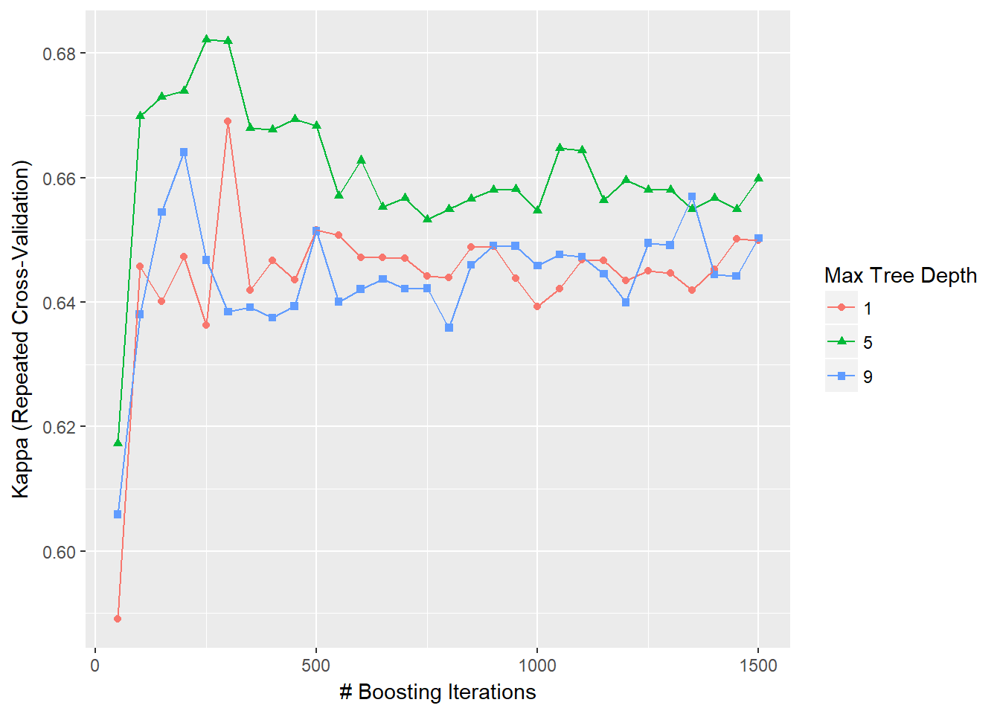
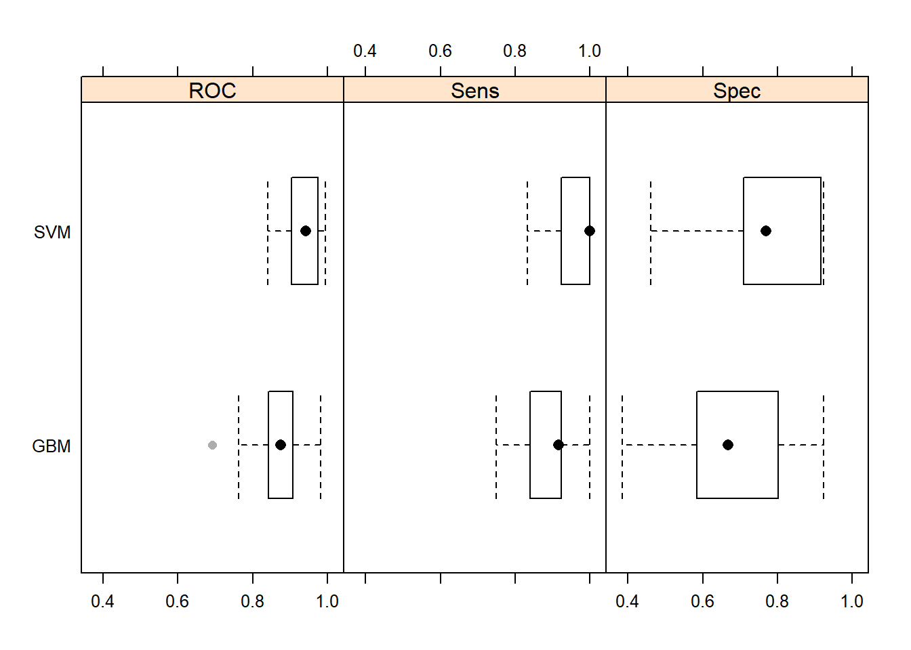
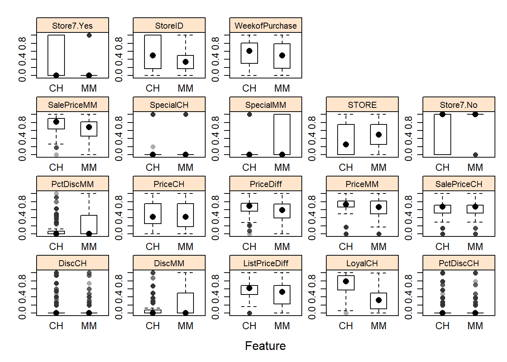
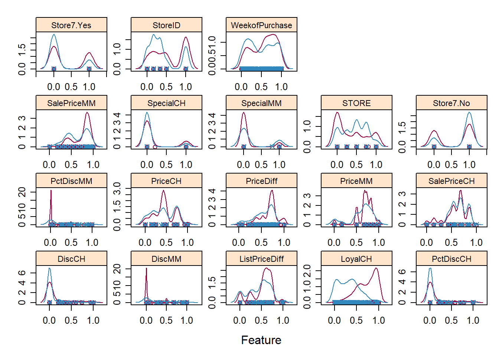
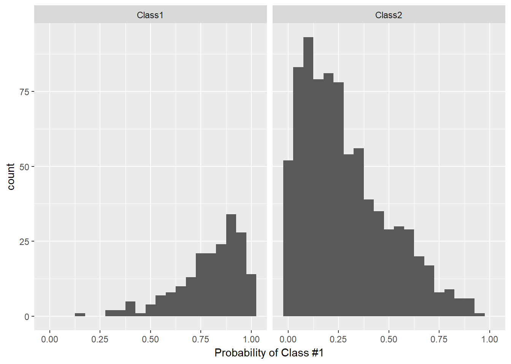
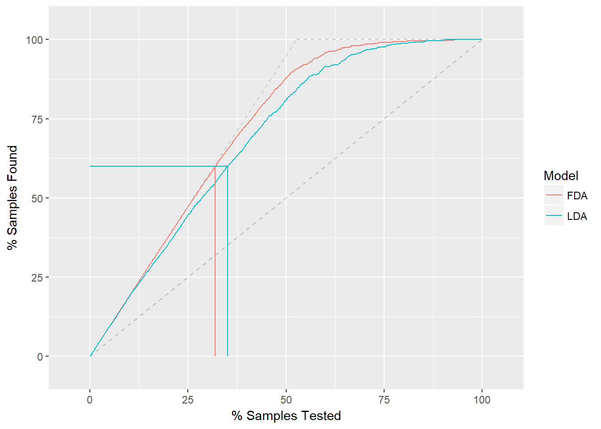

# Caret Package

```r
library(caret)
```

```
## Warning: package 'caret' was built under R version 3.3.3
```

```
## Loading required package: lattice
```

```
## Loading required package: ggplot2
```

```
## Warning: package 'ggplot2' was built under R version 3.3.3
```

```r
orange <- read.csv('https://raw.githubusercontent.com/selva86/datasets/master/orange_juice_withmissing.csv')

path = "C:/Website Rmarkdown/bookdown/save/"
```


## Pre-Processing
Serveral function can be use to preprocess the data. Caret package assume that variables are numeric. Factor have been converted to dummy. 

  - **Create Dummy variables**
    - dummyVars() : create dummy from one or more factors. In caret, one-hot-encodings can be created using dummyVars(). Just pass in all the features to dummyVars() as the training data and all the factor columns will automatically be converted to one-hot-encodings.


  - **Near Zero Variance Prédictors**
    - Si variables as un seul facteur ou très peu de varianc, elles peuvent biasé une les modèles prédictifs. Si predictor trop unballanced, when we split data in subsample for crossvalidation or other subsample, predictor may become zero variance.
    - some metric :
      - fréquency ratio : frequency of the most prevalent value over the second most frequent.  (proche de 1 si bien equilibré)
      - percent of unique values : number of unique values divided by the total number of samples. Approaches zero as the granularity of the data increases 

  - **Identifying correlated predictors**
    - findCorrelation() function uses the following algorithm to flag predictors for removal. 

  - **Linear dependencies**
    - findLinearCombos() function uses the QR decomposition of a matrix to enumerate sets of linear combinations 
    
    
    ```r
    ## Dummy variable    
    library(earth)
    ```
    
    ```
    ## Warning: package 'earth' was built under R version 3.3.3
    ```
    
    ```
    ## Loading required package: plotmo
    ```
    
    ```
    ## Loading required package: plotrix
    ```
    
    ```
    ## Loading required package: TeachingDemos
    ```
    
    ```
    ## Warning: package 'TeachingDemos' was built under R version 3.3.3
    ```
    
    ```r
    data(etitanic)
    head(model.matrix(survived ~ ., data = etitanic))
    ```
    
    ```
    ##   (Intercept) pclass2nd pclass3rd sexmale     age sibsp parch
    ## 1           1         0         0       0 29.0000     0     0
    ## 2           1         0         0       1  0.9167     1     2
    ## 3           1         0         0       0  2.0000     1     2
    ## 4           1         0         0       1 30.0000     1     2
    ## 5           1         0         0       0 25.0000     1     2
    ## 6           1         0         0       1 48.0000     0     0
    ```
    
    ```r
    # Use dummyVars to create dummy
    dummies <- dummyVars(survived ~ ., data = etitanic)
    head(predict(dummies, newdata = etitanic))
    ```
    
    ```
    ##   pclass.1st pclass.2nd pclass.3rd sex.female sex.male     age sibsp parch
    ## 1          1          0          0          1        0 29.0000     0     0
    ## 2          1          0          0          0        1  0.9167     1     2
    ## 3          1          0          0          1        0  2.0000     1     2
    ## 4          1          0          0          0        1 30.0000     1     2
    ## 5          1          0          0          1        0 25.0000     1     2
    ## 6          1          0          0          0        1 48.0000     0     0
    ```
    
    ```r
    ## Near zero variance
    data(mdrr)
    data.frame(table(mdrrDescr$nR11))
    ```
    
    ```
    ##   Var1 Freq
    ## 1    0  501
    ## 2    1    4
    ## 3    2   23
    ```
    
    ```r
    nzv <- nearZeroVar(mdrrDescr, saveMetrics= TRUE)
    nzv[nzv$nzv,][1:10,]
    ```
    
    ```
    ##        freqRatio percentUnique zeroVar  nzv
    ## nTB     23.00000     0.3787879   FALSE TRUE
    ## nBR    131.00000     0.3787879   FALSE TRUE
    ## nI     527.00000     0.3787879   FALSE TRUE
    ## nR03   527.00000     0.3787879   FALSE TRUE
    ## nR08   527.00000     0.3787879   FALSE TRUE
    ## nR11    21.78261     0.5681818   FALSE TRUE
    ## nR12    57.66667     0.3787879   FALSE TRUE
    ## D.Dr03 527.00000     0.3787879   FALSE TRUE
    ## D.Dr07 123.50000     5.8712121   FALSE TRUE
    ## D.Dr08 527.00000     0.3787879   FALSE TRUE
    ```
    
    ```r
    nzv <- nearZeroVar(mdrrDescr)
    filteredDescr <- mdrrDescr[, -nzv]
    dim(filteredDescr)
    ```
    
    ```
    ## [1] 528 297
    ```
    
    ```r
    ## correlated predictors
    descrCor <-  cor(filteredDescr)
    highCorr <- sum(abs(descrCor[upper.tri(descrCor)]) > .999)
    # there are 65 descriptors that are almost perfectly correlated
    
    summary(descrCor[upper.tri(descrCor)])
    ```
    
    ```
    ##     Min.  1st Qu.   Median     Mean  3rd Qu.     Max. 
    ## -0.99610 -0.05373  0.25010  0.26080  0.65530  1.00000
    ```
    
    ```r
    # remove var with corr above 0.75
    highlyCorDescr <- findCorrelation(descrCor, cutoff = .75)
    filteredDescr <- filteredDescr[,-highlyCorDescr]
    descrCor2 <- cor(filteredDescr)
    summary(descrCor2[upper.tri(descrCor2)])
    ```
    
    ```
    ##     Min.  1st Qu.   Median     Mean  3rd Qu.     Max. 
    ## -0.70730 -0.05378  0.04418  0.06692  0.18860  0.74460
    ```
    
    ```r
    ## Linear dependencies
    # comboInfo <- findLinearCombos(ltfrDesign)
    # comboInfo
    # ltfrDesign[, -comboInfo$remove]
    ```

  - **preProcess**
    - Operation on predictor like centering, scaling, ...
    - can be use in train() function 
    - Imputation
        -  KNN : For an arbitrary sample, the K closest neighbors are found in the training set and the value for the predictor is imputed using these values (e.g. using the mean)
        - Bagged tree : For each predictor in the data, a bagged tree is created using all of the other predictors in the training set. When a new sample has a missing predictor value, the bagged model is used to predict the value. 
    - TRansforming predictor : need to be centered and scaled
      - PCA
      - boxcox : data need to be greater than zero
      - exponential transformation, Yeo-Johnson ..
    
  


```r
library(AppliedPredictiveModeling)
data(schedulingData)

# The data are a mix of categorical and numeric predictors. 
#  Yeo-Johnson transformation on the continuous predictors then center and scale them. 

pp_hpc <- preProcess(schedulingData[, -8], 
                     method = c("center", "scale", "YeoJohnson"))
pp_hpc
```

```
## Created from 4331 samples and 7 variables
## 
## Pre-processing:
##   - centered (5)
##   - ignored (2)
##   - scaled (5)
##   - Yeo-Johnson transformation (5)
## 
## Lambda estimates for Yeo-Johnson transformation:
## -0.08, -0.03, -1.05, -1.1, 1.44
```

```r
# Use predict to get transformed data
transformed <- predict(pp_hpc, newdata = schedulingData[, -8])
head(transformed)
```

```
##   Protocol  Compounds InputFields Iterations NumPending         Hour Day
## 1        E  1.2289592  -0.6324580 -0.0615593  -0.554123  0.004586516 Tue
## 2        E -0.6065826  -0.8120473 -0.0615593  -0.554123 -0.043733201 Tue
## 3        E -0.5719534  -1.0131504 -2.7894869  -0.554123 -0.034967177 Thu
## 4        E -0.6427737  -1.0047277 -0.0615593  -0.554123 -0.964170752 Fri
## 5        E -0.5804713  -0.9564504 -0.0615593  -0.554123 -0.902085020 Fri
## 6        E -0.5804713  -0.9564504 -0.0615593  -0.554123  0.698108782 Wed
```

```r
# the predictor for the number of pending jobs, has a very sparse and unbalanced distribution:
mean(schedulingData$NumPending == 0)
```

```
## [1] 0.7561764
```

```r
# We can add a filter to check for zero- or near zero-variance predictors prior to running the pre-processing calculations : 

pp_no_nzv <- preProcess(schedulingData[, -8], 
                        method = c("center", "scale", "YeoJohnson", "nzv"))
pp_no_nzv
```

```
## Created from 4331 samples and 7 variables
## 
## Pre-processing:
##   - centered (4)
##   - ignored (2)
##   - removed (1)
##   - scaled (4)
##   - Yeo-Johnson transformation (4)
## 
## Lambda estimates for Yeo-Johnson transformation:
## -0.08, -0.03, -1.05, 1.44
```

```r
predict(pp_no_nzv, newdata = schedulingData[1:6, -8])
```

```
##   Protocol  Compounds InputFields Iterations         Hour Day
## 1        E  1.2289592  -0.6324580 -0.0615593  0.004586516 Tue
## 2        E -0.6065826  -0.8120473 -0.0615593 -0.043733201 Tue
## 3        E -0.5719534  -1.0131504 -2.7894869 -0.034967177 Thu
## 4        E -0.6427737  -1.0047277 -0.0615593 -0.964170752 Fri
## 5        E -0.5804713  -0.9564504 -0.0615593 -0.902085020 Fri
## 6        E -0.5804713  -0.9564504 -0.0615593  0.698108782 Wed
```
    
    

  - **Class distance calculations**  
  

caret contain fonction to generate new predictors variables based on distance to class centroids (see linear discriminant analysis).  For each level of a factor variable, the class centroid and covariance matrix is calculated. For new samples, the Mahalanobis distance to each of the class centroids is computed and can be used as an additional predictor. This can be helpful for non-linear models when the true decision boundary is actually linear.


    
    
    
## Data Splitting 

  - **Simple splitting based on the outcome**
    - createDataPartition  : create balanced split of the data
      - list = FALSE avoids returning the data as a list
      - times, that can create multiple splits at once
      - the data indices are returned in a list of integer vectors
    - createResample can be used to make simple bootstrap samples
    createFolds can be used to generate balanced crossvalidation groupings from a set of data.
  - **splitting based on the predictors**
    - maxDissim can be used to create subsamples using a maximum dissimilarity approach.
  - **Data splitting for time series**
    - createTimeSlices 
      - initialWindow: the initial number of consecutive values in each training set sample
      - horizon: The number of consecutive values in test set sample
      - fixedWindow: A logical: if FALSE, the training set always start at the first sample and the training set size will vary over data splits.
  - **splitting with important groups**
    -   see documentation package


```r
library(mlbench)
```

```
## Warning: package 'mlbench' was built under R version 3.3.3
```

```r
load(file = "C:/Website Rmarkdown/bookdown/save/Sonar.RData")
 
# inTraining <- createDataPartition(Sonar$Class, p = .75, list = FALSE)
# training <- Sonar[ inTraining,]
training = sonar_train
# testing  <- Sonar[-inTraining,]
testing = sonar_test
```


## Model Training and tuning

  - ** train() function**
    - evaluate, using resampling, the effect of model tuning parameters on performance
    - Choose the optimalâ model across these parameters
    - Estimate model performance from a training set

  - **Train() algorithm**
      - for each parameter set
          - for each resampling iteration
            - fit
            - predict on train set out of sample
          - end
          - calculate average perfomance
      - end
      - determine optimal paramater set
      - fit final model
 
   - **information to done**
    - model type
    - parameter value
    - resampling solution
      - k fold crossvalidation :  Te original sample is randomly partitioned into k equal sized subsamples. Of the k subsamples, a single subsample is retained as the validation data for testing the model, and the remaining k-1 subsamples are used as training data. And repeated. The k results can then be averaged to produce a single estimation.
      
      - Leave one out 
      - Bootstrap : random sampling with replacement
 
 
### Exemple : Basic tuning for  boosted tree model GBM   

```r
fitControl <- trainControl(    method = "repeatedcv"  
                             , number = 10,          ## 10-fold CV  : number of fold or number of resampling iteration
                               repeats = 10)         ## repeated ten times
 
# gbmFit1 <- train(Class ~ ., data = training, 
#                  method = "gbm", 
#                  trControl = fitControl,
#                  ## This last option is actually one for gbm() that passes through
#                  verbose = FALSE)

# save(gbmFit1, file= paste(path, "gbmfit1.RData",sep="" ))
load(file= paste(path, "gbmfit1.RData",sep="" ))

gbmFit1 
```

```
## Stochastic Gradient Boosting 
## 
## 125 samples
##  60 predictor
##   2 classes: 'M', 'R' 
## 
## No pre-processing
## Resampling: Cross-Validated (10 fold, repeated 10 times) 
## Summary of sample sizes: 113, 111, 113, 112, 113, 113, ... 
## Resampling results across tuning parameters:
## 
##   interaction.depth  n.trees  Accuracy   Kappa    
##   1                   50      0.7951923  0.5889691
##   1                  100      0.8030403  0.6043046
##   1                  150      0.8131868  0.6246497
##   2                   50      0.8161630  0.6305226
##   2                  100      0.8253938  0.6491769
##   2                  150      0.8308059  0.6599040
##   3                   50      0.8129945  0.6245649
##   3                  100      0.8247344  0.6475546
##   3                  150      0.8336630  0.6657373
## 
## Tuning parameter 'shrinkage' was held constant at a value of 0.1
## 
## Tuning parameter 'n.minobsinnode' was held constant at a value of 10
## Accuracy was used to select the optimal model using the largest value.
## The final values used for the model were n.trees = 150,
##  interaction.depth = 3, shrinkage = 0.1 and n.minobsinnode = 10.
```
 
  - For a gradient boosting machine (GBM) model, there are three main tuning parameters:
     - number of iterations, i.e.trees, (called n.trees in the gbm function)
     - complexity of the tree, called interaction.depth
     - learning rate: how quickly the algorithm adapts, called shrinkage 
     - the minimum number of training set samples in a node to commence splitting (n.minobsinnode)
     
 
Train() can automatically create a grid of tuning parameters. By default, if p is the number of tuning parameters, the grid size is 3^p. 


### Customizing the Tuning Process

  -  **Alternate Tuning Grid*s** : tuneGrid option in train
    - Par défaut train chose model with largest perfomance value.
    - Il existe d'autr methode de recherche pour le uning des paramètre comme random search ( option search = "random" in the call to trainControl)

  - **Plotting the resampling profile**
    - Plot function to examine the relationship between the estimates of the performance and the tuning parameters. 
    
  - **trainControl** : generates parameters that further control how models are created
    - Method = boot, cv, repeatedcv , ...
      - oob = out-of-bag estimates (for DT or RF)
    - number and repeats (only if repeatedcv): number controls with the numbe r of folds in K-fold cross-validation or number of resampling iterations for bootstrapping
    - allowParallel: a logical that governs whether train should use parallel processing (if availible).
    - summaryFunction that specifies a function for computing performance for user defined performance metrics

  - **Alternate Performance Metrics**
    - defaut ;  RMSE, MSA, R2 for regression and accurancy , kappa for classification.
    - twoClassSummary() function, will compute the sensitivity, specificity and area under the ROC curve:

  - **Choosing the Final model**
    - train allows the user to specify alternate rules for selecting the final model. The argument selectionFunction can be used to supply a function to algorithmically determine the final model. User-defined functions can be used.
      -  tolerance function could be used to find a less complex model. 
      
  - **Extracting Predictions and Class Probabilities**
    - objects produced by the train function contain the optimized model in the finalModel sub-object
    - predict.train, the type options are standardized to be "class" and "prob"
    
  - **Fitting Models Without Parameter Tuning**
      - In cases where the model tuning values are known, train can be used to fit the model to the entire training set without any resampling or parameter tuning. Using the method = "none" option in trainControl
 

```r
gbmGrid <-  expand.grid(interaction.depth = c(1, 5, 9), 
                        n.trees = (1:30)*50, 
                        shrinkage = 0.1,
                        n.minobsinnode = 20)
 
# gbmFit2 <- train(Class ~ ., data = training, 
#                  method = "gbm", 
#                  trControl = fitControl, 
#                  verbose = FALSE, 
#                  ## Now specify the exact models 
#                  ## to evaluate:
#                  tuneGrid = gbmGrid)
# 
# save(gbmFit2,file= paste(path, "gbmFit2.RData",sep="" ))

load(file=paste(path, "gbmFit2.RData",sep="" ))
gbmFit2
```

```
## Stochastic Gradient Boosting 
## 
## 125 samples
##  60 predictor
##   2 classes: 'M', 'R' 
## 
## No pre-processing
## Resampling: Cross-Validated (10 fold, repeated 10 times) 
## Summary of sample sizes: 112, 113, 113, 113, 113, 113, ... 
## Resampling results across tuning parameters:
## 
##   interaction.depth  n.trees  Accuracy   Kappa    
##   1                    50     0.7952747  0.5890794
##   1                   100     0.8237271  0.6458003
##   1                   150     0.8209524  0.6401562
##   1                   200     0.8243407  0.6472826
##   1                   250     0.8191117  0.6363364
##   1                   300     0.8352656  0.6690219
##   1                   350     0.8219139  0.6419521
##   1                   400     0.8243407  0.6467396
##   1                   450     0.8229304  0.6436160
##   1                   500     0.8267857  0.6516025
##   1                   550     0.8261996  0.6507117
##   1                   600     0.8246062  0.6471799
##   1                   650     0.8245330  0.6471900
##   1                   700     0.8245513  0.6470475
##   1                   750     0.8229945  0.6441716
##   1                   800     0.8230037  0.6439807
##   1                   850     0.8253205  0.6488246
##   1                   900     0.8254396  0.6489119
##   1                   950     0.8228205  0.6438626
##   1                  1000     0.8205128  0.6393080
##   1                  1050     0.8219780  0.6421932
##   1                  1100     0.8244139  0.6468354
##   1                  1150     0.8242949  0.6467066
##   1                  1200     0.8227473  0.6435008
##   1                  1250     0.8234615  0.6450454
##   1                  1300     0.8232784  0.6446687
##   1                  1350     0.8218681  0.6418844
##   1                  1400     0.8235256  0.6452181
##   1                  1450     0.8260256  0.6502181
##   1                  1500     0.8259615  0.6499707
##   5                    50     0.8094322  0.6172790
##   5                   100     0.8355952  0.6698408
##   5                   150     0.8370696  0.6729793
##   5                   200     0.8377106  0.6739154
##   5                   250     0.8417491  0.6821800
##   5                   300     0.8418040  0.6819201
##   5                   350     0.8349359  0.6679888
##   5                   400     0.8348077  0.6677639
##   5                   450     0.8355220  0.6694073
##   5                   500     0.8347985  0.6683104
##   5                   550     0.8293407  0.6570683
##   5                   600     0.8322436  0.6627737
##   5                   650     0.8285165  0.6553292
##   5                   700     0.8292216  0.6567569
##   5                   750     0.8275549  0.6532773
##   5                   800     0.8283883  0.6549422
##   5                   850     0.8291575  0.6565849
##   5                   900     0.8299267  0.6580735
##   5                   950     0.8299908  0.6581782
##   5                  1000     0.8282692  0.6547392
##   5                  1050     0.8332051  0.6647494
##   5                  1100     0.8330128  0.6643746
##   5                  1150     0.8290385  0.6563774
##   5                  1200     0.8306410  0.6596469
##   5                  1250     0.8298718  0.6580788
##   5                  1300     0.8298718  0.6580788
##   5                  1350     0.8282692  0.6549547
##   5                  1400     0.8291667  0.6567222
##   5                  1450     0.8282692  0.6549874
##   5                  1500     0.8307051  0.6598866
##   9                    50     0.8039377  0.6058817
##   9                   100     0.8198901  0.6380325
##   9                   150     0.8278938  0.6544494
##   9                   200     0.8328846  0.6640918
##   9                   250     0.8241026  0.6467630
##   9                   300     0.8203205  0.6384411
##   9                   350     0.8204487  0.6391572
##   9                   400     0.8197527  0.6375170
##   9                   450     0.8205678  0.6393621
##   9                   500     0.8267308  0.6514263
##   9                   550     0.8210897  0.6400578
##   9                   600     0.8219872  0.6420808
##   9                   650     0.8226923  0.6437323
##   9                   700     0.8219139  0.6421279
##   9                   750     0.8220513  0.6422191
##   9                   800     0.8189744  0.6358772
##   9                   850     0.8239011  0.6459592
##   9                   900     0.8254396  0.6490944
##   9                   950     0.8253114  0.6490100
##   9                  1000     0.8237729  0.6458428
##   9                  1050     0.8246703  0.6476778
##   9                  1100     0.8244780  0.6473060
##   9                  1150     0.8230678  0.6445128
##   9                  1200     0.8208150  0.6399585
##   9                  1250     0.8256227  0.6495035
##   9                  1300     0.8254396  0.6491686
##   9                  1350     0.8294139  0.6569814
##   9                  1400     0.8231227  0.6444333
##   9                  1450     0.8230678  0.6442198
##   9                  1500     0.8260897  0.6503138
## 
## Tuning parameter 'shrinkage' was held constant at a value of 0.1
## 
## Tuning parameter 'n.minobsinnode' was held constant at a value of 20
## Accuracy was used to select the optimal model using the largest value.
## The final values used for the model were n.trees = 300,
##  interaction.depth = 5, shrinkage = 0.1 and n.minobsinnode = 20.
```

```r
trellis.par.set(caretTheme())
ggplot(gbmFit2, metric = "Kappa")
```



```r
fitControl <- trainControl(method = "repeatedcv",
                           number = 10,
                           repeats = 10,           
                           classProbs = TRUE, ## Estimate class probabilities
                           ## Evaluate performance using 
                           ## the following function
                           summaryFunction = twoClassSummary)

# gbmFit3 <- train(Class ~ ., data = training, 
#                  method = "gbm", 
#                  trControl = fitControl, 
#                  verbose = FALSE, 
#                  tuneGrid = gbmGrid,
#                  ## Specify which metric to optimize
#                  metric = "ROC")
# save(gbmFit3,file= paste(path, "gbmFit3.RData",sep="" ))

load(file=paste(path, "gbmFit3.RData",sep="" ))

gbmFit3
```

```
## Stochastic Gradient Boosting 
## 
## 125 samples
##  60 predictor
##   2 classes: 'M', 'R' 
## 
## No pre-processing
## Resampling: Cross-Validated (10 fold, repeated 10 times) 
## Summary of sample sizes: 113, 112, 113, 113, 111, 113, ... 
## Resampling results across tuning parameters:
## 
##   interaction.depth  n.trees  ROC        Sens       Spec     
##   1                    50     0.8777211  0.8304762  0.7542857
##   1                   100     0.8940363  0.8545238  0.8016667
##   1                   150     0.8937075  0.8583333  0.8042857
##   1                   200     0.8940023  0.8583333  0.7964286
##   1                   250     0.8933333  0.8626190  0.8011905
##   1                   300     0.8944898  0.8678571  0.8061905
##   1                   350     0.8995181  0.8692857  0.8092857
##   1                   400     0.8976474  0.8676190  0.8169048
##   1                   450     0.8972222  0.8633333  0.8104762
##   1                   500     0.8977438  0.8614286  0.8123810
##   1                   550     0.8960714  0.8597619  0.8088095
##   1                   600     0.8984580  0.8597619  0.8057143
##   1                   650     0.8985034  0.8514286  0.8057143
##   1                   700     0.8979535  0.8533333  0.8071429
##   1                   750     0.8969558  0.8535714  0.8071429
##   1                   800     0.8960034  0.8535714  0.8038095
##   1                   850     0.8954478  0.8519048  0.8054762
##   1                   900     0.8944501  0.8530952  0.8021429
##   1                   950     0.8962302  0.8533333  0.8002381
##   1                  1000     0.8965873  0.8516667  0.8121429
##   1                  1050     0.8968707  0.8516667  0.8038095
##   1                  1100     0.8956009  0.8516667  0.8092857
##   1                  1150     0.8960374  0.8483333  0.8057143
##   1                  1200     0.8954819  0.8485714  0.8104762
##   1                  1250     0.8936961  0.8435714  0.8095238
##   1                  1300     0.8954025  0.8497619  0.8057143
##   1                  1350     0.8938946  0.8464286  0.8040476
##   1                  1400     0.8923866  0.8464286  0.8040476
##   1                  1450     0.8916327  0.8480952  0.8054762
##   1                  1500     0.8923073  0.8497619  0.8054762
##   5                    50     0.8746542  0.8269048  0.7692857
##   5                   100     0.8948016  0.8423810  0.7840476
##   5                   150     0.8944331  0.8502381  0.7980952
##   5                   200     0.8927664  0.8588095  0.7959524
##   5                   250     0.8954989  0.8554762  0.8023810
##   5                   300     0.8937925  0.8552381  0.8054762
##   5                   350     0.8918481  0.8554762  0.8073810
##   5                   400     0.8942120  0.8602381  0.8092857
##   5                   450     0.8898696  0.8602381  0.8126190
##   5                   500     0.8920181  0.8504762  0.8076190
##   5                   550     0.8919274  0.8504762  0.8059524
##   5                   600     0.8931236  0.8488095  0.8028571
##   5                   650     0.8930499  0.8523810  0.8042857
##   5                   700     0.8940420  0.8440476  0.8073810
##   5                   750     0.8946372  0.8473810  0.8040476
##   5                   800     0.8959070  0.8440476  0.8073810
##   5                   850     0.8949603  0.8485714  0.8090476
##   5                   900     0.8946882  0.8421429  0.8076190
##   5                   950     0.8942120  0.8433333  0.8092857
##   5                  1000     0.8926644  0.8435714  0.8076190
##   5                  1050     0.8933390  0.8483333  0.8107143
##   5                  1100     0.8941723  0.8469048  0.8107143
##   5                  1150     0.8947279  0.8483333  0.8171429
##   5                  1200     0.8940079  0.8452381  0.8171429
##   5                  1250     0.8909977  0.8469048  0.8138095
##   5                  1300     0.8926984  0.8416667  0.8090476
##   5                  1350     0.8918651  0.8435714  0.8140476
##   5                  1400     0.8937358  0.8454762  0.8104762
##   5                  1450     0.8936961  0.8450000  0.8090476
##   5                  1500     0.8944104  0.8483333  0.8138095
##   9                    50     0.8792517  0.8414286  0.7738095
##   9                   100     0.8923696  0.8421429  0.7907143
##   9                   150     0.8922846  0.8633333  0.7971429
##   9                   200     0.8911905  0.8561905  0.7921429
##   9                   250     0.8906009  0.8611905  0.8014286
##   9                   300     0.8902324  0.8614286  0.7945238
##   9                   350     0.8909127  0.8595238  0.7957143
##   9                   400     0.8907937  0.8611905  0.7959524
##   9                   450     0.8890873  0.8583333  0.7978571
##   9                   500     0.8908333  0.8580952  0.7959524
##   9                   550     0.8895125  0.8547619  0.8026190
##   9                   600     0.8905045  0.8511905  0.8009524
##   9                   650     0.8901814  0.8466667  0.8011905
##   9                   700     0.8901474  0.8483333  0.8009524
##   9                   750     0.8924490  0.8469048  0.8059524
##   9                   800     0.8942347  0.8471429  0.8061905
##   9                   850     0.8926190  0.8407143  0.8045238
##   9                   900     0.8939966  0.8464286  0.8045238
##   9                   950     0.8926927  0.8435714  0.8028571
##   9                  1000     0.8917857  0.8388095  0.7995238
##   9                  1050     0.8926134  0.8466667  0.8059524
##   9                  1100     0.8923753  0.8438095  0.8109524
##   9                  1150     0.8935261  0.8421429  0.8142857
##   9                  1200     0.8928401  0.8390476  0.8126190
##   9                  1250     0.8920522  0.8359524  0.8109524
##   9                  1300     0.8923299  0.8373810  0.8126190
##   9                  1350     0.8924093  0.8407143  0.8126190
##   9                  1400     0.8921429  0.8407143  0.8092857
##   9                  1450     0.8932143  0.8409524  0.8109524
##   9                  1500     0.8926247  0.8392857  0.8109524
## 
## Tuning parameter 'shrinkage' was held constant at a value of 0.1
## 
## Tuning parameter 'n.minobsinnode' was held constant at a value of 20
## ROC was used to select the optimal model using the largest value.
## The final values used for the model were n.trees = 350,
##  interaction.depth = 1, shrinkage = 0.1 and n.minobsinnode = 20.
```

```r
whichTwoPct <- tolerance(gbmFit3$results, metric = "ROC", 
                         tol = 2, maximize = TRUE)  
gbmFit3$results[whichTwoPct,1:6]
```

```
##   shrinkage interaction.depth n.minobsinnode n.trees       ROC      Sens
## 2       0.1                 1             20     100 0.8940363 0.8545238
```

```r
# This indicates that we can get a less complex model with an area under the ROC curve of 0.901 (compared to the pick the best value of 0.914).

# predict(gbmFit3, newdata = head(testing))

# predict(gbmFit3, newdata = head(testing), type = "prob")


# Fitting Models Without Parameter Tuning

fitControl <- trainControl(method = "none", classProbs = TRUE)

set.seed(825)
# gbmFit4 <- train(Class ~ ., data = training, 
#                  method = "gbm", 
#                  trControl = fitControl, 
#                  verbose = FALSE, 
#                  ## Only a single model can be passed to the
#                  ## function when no resampling is used:
#                  tuneGrid = data.frame(interaction.depth = 4,
#                                        n.trees = 100,
#                                        shrinkage = .1,
#                                        n.minobsinnode = 20),
#                  metric = "ROC")

# save(gbmFit4,file= paste(path, "gbmFit4.RData",sep="" ))

load(file=paste(path, "gbmFit4.RData",sep="" ))

gbmFit4
```

```
## Stochastic Gradient Boosting 
## 
## 125 samples
##  60 predictor
##   2 classes: 'M', 'R' 
## 
## No pre-processing
## Resampling: None
```
 
 
  -  **Random hyperparameter search**

To use random search, another option is available in trainControl called search. Possible values of this argument are "grid" and "random". The built-in models contained in caret contain code to generate random tuning parameter combinations. The total number of unique combinations is specified by the tuneLength option to train.


```r
fitControl <- trainControl(method = "repeatedcv",
                           number = 5,
                           repeats = 3,
                           classProbs = TRUE,
                           summaryFunction = twoClassSummary,
                           search = "random",
                           verboseIter =  FALSE)

# rda_fit <- train(Class ~ ., data = training, 
#                   method = "rda",
#                   metric = "ROC",
#                   tuneLength = 30,
#                   trControl = fitControl)
# 
# save(rda_fit,file= paste(path, "rda_fit.RData",sep="" ))

load(file=paste(path, "rda_fit.RData",sep="" ))

rda_fit
```

```
## Regularized Discriminant Analysis 
## 
## 125 samples
##  60 predictor
##   2 classes: 'M', 'R' 
## 
## No pre-processing
## Resampling: Cross-Validated (5 fold, repeated 3 times) 
## Summary of sample sizes: 100, 99, 101, 100, 100, 100, ... 
## Resampling results across tuning parameters:
## 
##   gamma       lambda       ROC        Sens       Spec     
##   0.03177874  0.767664044  0.8443677  0.8153846  0.7529915
##   0.03868192  0.499283304  0.8470113  0.8158120  0.7692308
##   0.11834801  0.974493793  0.8548214  0.8094017  0.7414530
##   0.12391186  0.018063038  0.8332950  0.8209402  0.7688034
##   0.13442487  0.868918547  0.8590757  0.8572650  0.7307692
##   0.19249104  0.335761243  0.8475619  0.8320513  0.7380342
##   0.23568481  0.064135040  0.8410585  0.8324786  0.7431624
##   0.23814584  0.986270274  0.8543694  0.8205128  0.7692308
##   0.25082994  0.674919744  0.8686199  0.8688034  0.7307692
##   0.28285931  0.576888058  0.8632287  0.8423077  0.7098291
##   0.29099029  0.474277013  0.8614152  0.8423077  0.7059829
##   0.29601805  0.002963208  0.8413516  0.8324786  0.7482906
##   0.33633553  0.283586169  0.8554350  0.8376068  0.7115385
##   0.41798776  0.881581948  0.8562158  0.8414530  0.7264957
##   0.45885413  0.701431940  0.8620781  0.8893162  0.7102564
##   0.48684373  0.545997273  0.8705375  0.8735043  0.6837607
##   0.48845661  0.377704420  0.8678364  0.8585470  0.6786325
##   0.51491517  0.592224877  0.8669242  0.8893162  0.7047009
##   0.53206420  0.339941226  0.8661900  0.8585470  0.6794872
##   0.54020648  0.253930177  0.8619521  0.8585470  0.6846154
##   0.56009903  0.183772303  0.8602756  0.8427350  0.6846154
##   0.56472058  0.995162379  0.8480304  0.7833333  0.7585470
##   0.58045730  0.773613530  0.8595880  0.8628205  0.7106838
##   0.67085142  0.287354882  0.8641984  0.8841880  0.6521368
##   0.69503284  0.348973440  0.8597304  0.8841880  0.6410256
##   0.72206263  0.653406920  0.8582512  0.8576923  0.6619658
##   0.76035804  0.183676074  0.8548050  0.8632479  0.6465812
##   0.81091174  0.317173641  0.8526052  0.8581197  0.6141026
##   0.86234436  0.272931617  0.8494549  0.8482906  0.6192308
##   0.98847635  0.580160726  0.7629684  0.7153846  0.6350427
## 
## ROC was used to select the optimal model using the largest value.
## The final values used for the model were gamma = 0.4868437 and lambda
##  = 0.5459973.
```

```r
# view of the random search
ggplot(rda_fit) + theme(legend.position = "top")
```


 
 
### Exploring and Comparing Resampling Distributions   
  - **Within Model**
    - explore relationships between tuning parameters and the resampling results for a specific model
      - xyplot and stripplot can be used to plot resampling statistics against (numeric) tuning parameters.
      - histogram and densityplot can also be used to look at distributions of the tuning parameters

  - **Between models**
    -  resample() can be use to collect the resampling result and make statistical statements about their performance differences of different model. 
    - several lattice plot methods that can be used to visualize the resampling distributions
    

```r
# svmFit <- train(Class ~ ., data = training, 
#                  method = "svmRadial", 
#                  trControl = fitControl, 
#                  preProc = c("center", "scale"),
#                  tuneLength = 8,
#                  metric = "ROC")
# 
# save(svmFit,file= paste(path, "svmFit.RData",sep="" ))

load(file=paste(path, "svmFit.RData",sep="" ))

resamps <- resamples(list(GBM = rda_fit,
                          SVM = svmFit))
summary(resamps)
```

```
## 
## Call:
## summary.resamples(object = resamps)
## 
## Models: GBM, SVM 
## Number of resamples: 15 
## 
## ROC 
##       Min. 1st Qu. Median   Mean 3rd Qu.   Max. NA's
## GBM 0.6923  0.8429 0.8750 0.8705  0.9071 0.9808    0
## SVM 0.8403  0.9046 0.9423 0.9335  0.9744 0.9941    0
## 
## Sens 
##       Min. 1st Qu. Median   Mean 3rd Qu. Max. NA's
## GBM 0.7500  0.8397 0.9167 0.8735  0.9231    1    0
## SVM 0.8333  0.9231 1.0000 0.9577  1.0000    1    0
## 
## Spec 
##       Min. 1st Qu. Median   Mean 3rd Qu.   Max. NA's
## GBM 0.3846  0.5833 0.6667 0.6838  0.8013 0.9231    0
## SVM 0.4615  0.7083 0.7692 0.7735  0.9167 0.9231    0
```

```r
theme1 <- trellis.par.get()
theme1$plot.symbol$col = rgb(.2, .2, .2, .4)
theme1$plot.symbol$pch = 16
theme1$plot.line$col = rgb(1, 0, 0, .7)
theme1$plot.line$lwd <- 2
trellis.par.set(theme1)
bwplot(resamps, layout = c(3, 1))
```



```r
dotplot(resamps, metric = "ROC")
```


```r
splom(resamps)
```


## Best available Models
- **Logit**
- **ababoost**
- **random forest**
- **xgboost**
- **SVM**


```r
trainRowNumbers <- createDataPartition(orange$Purchase, p=0.8, list=FALSE)

trainData <- orange[trainRowNumbers,]
testData <- orange[-trainRowNumbers,]

x = trainData[, 2:18]
y = trainData$Purchase

# library(skimr)
# skimmed <- skim_to_wide(trainData)
# skimmed[, c(1:5, 9:11, 13, 15:16)]

preProcess_missingdata_model <- preProcess(trainData, method='knnImpute')
preProcess_missingdata_model
```

```
## Created from 823 samples and 18 variables
## 
## Pre-processing:
##   - centered (16)
##   - ignored (2)
##   - 5 nearest neighbor imputation (16)
##   - scaled (16)
```

```r
trainData <- predict(preProcess_missingdata_model, newdata = trainData)
anyNA(trainData)
```

```
## [1] FALSE
```

```r
# Creating dummy variables is converting a categorical variable to as many binary variables as here are categories.
dummies_model <- dummyVars(Purchase ~ ., data=trainData)
trainData_mat <- predict(dummies_model, newdata = trainData)
```

```
## Warning in model.frame.default(Terms, newdata, na.action = na.action, xlev
## = object$lvls): variable 'Purchase' is not a factor
```

```r
trainData <- data.frame(trainData_mat)

preProcess_range_model <- preProcess(trainData, method='range')
trainData <- predict(preProcess_range_model, newdata = trainData)

# Append the Y variable
trainData$Purchase <- y

featurePlot(x = trainData[, 1:18], 
            y = trainData$Purchase, 
            plot = "box",
            strip=strip.custom(par.strip.text=list(cex=.7)),
            scales = list(x = list(relation="free"), 
                          y = list(relation="free")))
```



```r
featurePlot(x = trainData[, 1:18], 
            y = trainData$Purchase, 
            plot = "density",
            strip=strip.custom(par.strip.text=list(cex=.7)),
            scales = list(x = list(relation="free"), 
                          y = list(relation="free")))
```



```r
# feature selection

subsets <- c(1:5, 10, 15, 18)

ctrl <- rfeControl(functions = rfFuncs,
                   method = "repeatedcv",
                   repeats = 5,
                   verbose = FALSE)

# lmProfile <- rfe(x=trainData[, 1:4], y=trainData$Purchase, 
#                sizes = subsets,
#                 rfeControl = ctrl)

# lmProfile

# modeling
## get some info
modelLookup('earth')
```

```
##   model parameter          label forReg forClass probModel
## 1 earth    nprune         #Terms   TRUE     TRUE      TRUE
## 2 earth    degree Product Degree   TRUE     TRUE      TRUE
```

```r
model_mars = train(Purchase ~ ., data=trainData, method='earth')
```

```
## Warning: glm.fit: fitted probabilities numerically 0 or 1 occurred
```

```
## Warning: glm.fit: fitted probabilities numerically 0 or 1 occurred

## Warning: glm.fit: fitted probabilities numerically 0 or 1 occurred

## Warning: glm.fit: fitted probabilities numerically 0 or 1 occurred

## Warning: glm.fit: fitted probabilities numerically 0 or 1 occurred

## Warning: glm.fit: fitted probabilities numerically 0 or 1 occurred
```

```r
fitted <- predict(model_mars)
plot(model_mars, main="Model Accuracies with MARS")
```


```r
varimp_mars <- varImp(model_mars)
plot(varimp_mars, main="Variable Importance with MARS")
```


```r
# same imputation for test set
testData2 <- predict(preProcess_missingdata_model, testData)  
testData3 <- predict(dummies_model, testData2)
```

```
## Warning in model.frame.default(Terms, newdata, na.action = na.action, xlev
## = object$lvls): variable 'Purchase' is not a factor
```

```r
testData4 <- predict(preProcess_range_model, testData3)
predicted <- predict(model_mars, testData4)
confusionMatrix(reference = testData$Purchase, data = predicted, mode='everything', positive='MM')
```

```
## Confusion Matrix and Statistics
## 
##           Reference
## Prediction  CH  MM
##         CH 112  17
##         MM  18  66
##                                          
##                Accuracy : 0.8357         
##                  95% CI : (0.779, 0.8828)
##     No Information Rate : 0.6103         
##     P-Value [Acc > NIR] : 7.167e-13      
##                                          
##                   Kappa : 0.6553         
##  Mcnemar's Test P-Value : 1              
##                                          
##             Sensitivity : 0.7952         
##             Specificity : 0.8615         
##          Pos Pred Value : 0.7857         
##          Neg Pred Value : 0.8682         
##               Precision : 0.7857         
##                  Recall : 0.7952         
##                      F1 : 0.7904         
##              Prevalence : 0.3897         
##          Detection Rate : 0.3099         
##    Detection Prevalence : 0.3944         
##       Balanced Accuracy : 0.8284         
##                                          
##        'Positive' Class : MM             
## 
```

```r
# tuning model

## by tunelength

fitControl <- trainControl(
    method = 'cv',                   # k-fold cross validation
    number = 5,                      # number of folds
    savePredictions = 'final',       # saves predictions for optimal tuning parameter
    classProbs = T,                  # should class probabilities be returned
    summaryFunction=twoClassSummary  # results summary function
) 

# tuneLength corresponds to the number of unique values for the tuning parameters caret will consider while forming the hyper parameter combinations.


# Step 1: Tune hyper parameters by setting tuneLength
model_mars2 = train(Purchase ~ ., data=trainData, method='earth', tuneLength = 5, metric='ROC', trControl = fitControl)
```

```
## Warning: glm.fit: fitted probabilities numerically 0 or 1 occurred
```

```r
model_mars2
```

```
## Multivariate Adaptive Regression Spline 
## 
## 857 samples
##  18 predictor
##   2 classes: 'CH', 'MM' 
## 
## No pre-processing
## Resampling: Cross-Validated (5 fold) 
## Summary of sample sizes: 685, 685, 686, 685, 687 
## Resampling results across tuning parameters:
## 
##   nprune  ROC        Sens       Spec     
##    2      0.8724471  0.8699084  0.7036183
##    6      0.8961577  0.8660989  0.7336047
##   11      0.8938492  0.8584799  0.7395749
##   15      0.8888883  0.8623077  0.7276346
##   20      0.8894142  0.8661172  0.7216644
## 
## Tuning parameter 'degree' was held constant at a value of 1
## ROC was used to select the optimal model using the largest value.
## The final values used for the model were nprune = 6 and degree = 1.
```

```r
# Step 2: Predict on testData and Compute the confusion matrix
predicted2 <- predict(model_mars2, testData4)
confusionMatrix(reference = testData$Purchase, data = predicted2, mode='everything', positive='MM')
```

```
## Confusion Matrix and Statistics
## 
##           Reference
## Prediction  CH  MM
##         CH 112  17
##         MM  18  66
##                                          
##                Accuracy : 0.8357         
##                  95% CI : (0.779, 0.8828)
##     No Information Rate : 0.6103         
##     P-Value [Acc > NIR] : 7.167e-13      
##                                          
##                   Kappa : 0.6553         
##  Mcnemar's Test P-Value : 1              
##                                          
##             Sensitivity : 0.7952         
##             Specificity : 0.8615         
##          Pos Pred Value : 0.7857         
##          Neg Pred Value : 0.8682         
##               Precision : 0.7857         
##                  Recall : 0.7952         
##                      F1 : 0.7904         
##              Prevalence : 0.3897         
##          Detection Rate : 0.3099         
##    Detection Prevalence : 0.3944         
##       Balanced Accuracy : 0.8284         
##                                          
##        'Positive' Class : MM             
## 
```

```r
# by tunegrid

marsGrid <-  expand.grid(nprune = c(2, 4, 6, 8, 10), 
                        degree = c(1, 2, 3))

# Step 2: Tune hyper parameters by setting tuneGrid
 model_mars3 = train(Purchase ~ ., data=trainData, method='earth', metric='ROC', tuneGrid = marsGrid, trControl = fitControl)
```

```
## Warning: glm.fit: fitted probabilities numerically 0 or 1 occurred
```

```r
 model_mars3
```

```
## Multivariate Adaptive Regression Spline 
## 
## 857 samples
##  18 predictor
##   2 classes: 'CH', 'MM' 
## 
## No pre-processing
## Resampling: Cross-Validated (5 fold) 
## Summary of sample sizes: 687, 685, 685, 686, 685 
## Resampling results across tuning parameters:
## 
##   degree  nprune  ROC        Sens       Spec     
##   1        2      0.8725588  0.8700366  0.7093623
##   1        4      0.8952736  0.8796703  0.7333786
##   1        6      0.8944987  0.8642674  0.7483492
##   1        8      0.8907373  0.8681319  0.7483944
##   1       10      0.8902256  0.8738462  0.7483944
##   2        2      0.8615232  0.8146337  0.7904116
##   2        4      0.8929948  0.8815568  0.7483492
##   2        6      0.8888741  0.8548535  0.7395296
##   2        8      0.8879558  0.8566850  0.7454093
##   2       10      0.8871599  0.8433333  0.7543193
##   3        2      0.8253030  0.8491026  0.6795115
##   3        4      0.8952165  0.8815385  0.7513795
##   3        6      0.8898686  0.8586081  0.7483492
##   3        8      0.8932491  0.8547436  0.7633650
##   3       10      0.8857792  0.8489744  0.7482587
## 
## ROC was used to select the optimal model using the largest value.
## The final values used for the model were nprune = 4 and degree = 1.
```

```r
# Step 3: Predict on testData and Compute the confusion matrix
predicted3 <- predict(model_mars3, testData4)
confusionMatrix(reference = testData$Purchase, data = predicted3, mode='everything', positive='MM')
```

```
## Confusion Matrix and Statistics
## 
##           Reference
## Prediction  CH  MM
##         CH 110  18
##         MM  20  65
##                                           
##                Accuracy : 0.8216          
##                  95% CI : (0.7635, 0.8705)
##     No Information Rate : 0.6103          
##     P-Value [Acc > NIR] : 2.139e-11       
##                                           
##                   Kappa : 0.6266          
##  Mcnemar's Test P-Value : 0.8711          
##                                           
##             Sensitivity : 0.7831          
##             Specificity : 0.8462          
##          Pos Pred Value : 0.7647          
##          Neg Pred Value : 0.8594          
##               Precision : 0.7647          
##                  Recall : 0.7831          
##                      F1 : 0.7738          
##              Prevalence : 0.3897          
##          Detection Rate : 0.3052          
##    Detection Prevalence : 0.3991          
##       Balanced Accuracy : 0.8146          
##                                           
##        'Positive' Class : MM              
## 
```

```r
# Compare model

# model_adaboost = train(Purchase ~ ., data=trainData[1:100,], method='adaboost', tuneLength=2, trControl = fitControl)

# model_rf = train(Purchase ~ ., data=trainData[1:100,], method='rf', tuneLength=5, trControl = fitControl)

# model_xgbDART = train(Purchase ~ ., data=trainData, method='xgbDART', tuneLength=5, trControl = fitControl, verbose=F)

# model_svmRadial = train(Purchase ~ ., data=trainData, method='svmRadial', tuneLength=15, trControl = fitControl)

# models_compare <- resamples(list(ADABOOST=model_adaboost, RF=model_rf)) #, XGBDART=model_xgbDART, MARS=model_mars3, SVM=model_svmRadial))

# save(models_compare,file= paste(path, "models_compare.RData",sep="" ))

load(file=paste(path, "models_compare.RData",sep="" ))

summary(models_compare)
```

```
## 
## Call:
## summary.resamples(object = models_compare)
## 
## Models: ADABOOST, RF 
## Number of resamples: 5 
## 
## ROC 
##            Min. 1st Qu. Median   Mean 3rd Qu.   Max. NA's
## ADABOOST 0.5000  0.5417 0.5741 0.6172  0.6759 0.7941    0
## RF       0.2353  0.4352 0.5278 0.5439  0.6324 0.8889    0
## 
## Sens 
##            Min. 1st Qu. Median   Mean 3rd Qu. Max. NA's
## ADABOOST 0.8333  0.8889 0.8889 0.9105  0.9412    1    0
## RF       0.9444  1.0000 1.0000 0.9889  1.0000    1    0
## 
## Spec 
##          Min. 1st Qu. Median Mean 3rd Qu. Max. NA's
## ADABOOST    0       0      0    0       0    0    0
## RF          0       0      0    0       0    0    0
```

```r
scales <- list(x=list(relation="free"), y=list(relation="free"))
bwplot(models_compare, scales=scales)
```


```r
#  ensemble predictions from multiple models using caretEnsemble

library(caretEnsemble)
```

```
## Warning: package 'caretEnsemble' was built under R version 3.3.3
```

```
## 
## Attaching package: 'caretEnsemble'
```

```
## The following object is masked from 'package:ggplot2':
## 
##     autoplot
```

```r
trainControl <- trainControl(method="repeatedcv", 
                             number=3, 
                             repeats=2,
                             savePredictions=TRUE, 
                             classProbs=TRUE)

algorithmList <- c('rf', 'adaboost') #, 'earth', 'xgbDART', 'svmRadial')

# models <- caretList(Purchase ~ ., data=trainData[1:50,], trControl=trainControl, methodList=algorithmList) 
# save(models,file= paste(path, "models.RData",sep="" ))

load(file=paste(path, "models.RData",sep="" ))

results <- resamples(models)
summary(results)
```

```
## 
## Call:
## summary.resamples(object = results)
## 
## Models: rf, adaboost 
## Number of resamples: 6 
## 
## Accuracy 
##            Min. 1st Qu. Median   Mean 3rd Qu.   Max. NA's
## rf       0.7500  0.7537 0.7647 0.7794  0.8088 0.8235    0
## adaboost 0.6471  0.6921 0.7353 0.7402  0.8006 0.8235    0
## 
## Kappa 
##             Min. 1st Qu.   Median     Mean  3rd Qu.   Max. NA's
## rf       -0.1034 -0.1018 -0.04839 -0.01887  0.00000 0.1905    0
## adaboost -0.2143 -0.1734 -0.13060 -0.05963 -0.02419 0.2941    0
```

```r
# Combine the predictions of multiple models to form a final prediction

# Create the trainControl
set.seed(101)
stackControl <- trainControl(method="repeatedcv", 
                             number=3, 
                             repeats=3,
                             savePredictions=TRUE, 
                             classProbs=TRUE)

# Ensemble the predictions of `models` to form a new combined prediction based on glm
stack.glm <- caretStack(models, method="glm", metric="Accuracy", trControl=stackControl)

# /!\ The ensembles tend to perform better if the predictions are less correlated with each other.

# Predict on testData
stack_predicteds <- predict(stack.glm, newdata=testData4)
```

 

## Parallel Processing 


```r
# library(doParallel)
# cl <- detectCores() 
# cl <- makePSOCKcluster(3)
# registerDoParallel(cl)
# 
# ## All subsequent models are then run in parallel
# model <- train(Class ~ ., data = training, method = "rf")
# 
# ## When you are done:
# stopCluster(cl)
# registerDoSEQ()
```


## Subsampling for class imbalances

Examples of sampling methods : 

  - **down-sampling**: randomly subset all the classes in the training set so that their class frequencies match the least prevalent class (downSample option)
  - **up-sampling**: randomly sample (with replacement) the minority class to be the same size as the majority class (upSample option)
  - **hybrid methods**: techniques such as SMOTE and ROSE down-sample the majority class and synthesize new data points in the minority class. There are two packages (DMwR and ROSE) that implement these procedures
  
In practice, one could take the training set and, before model fitting, sample the data. During model may not reflect the class imbalance that future predictions would encounter. This is likely to lead to overly optimistic estimates of performance. 

The default behavior is to subsample the data prior to pre-processing. This can be easily changed and an example is given below.


Deux aporoche 
  - Use sampling before model crossvalidation 
  - use sampling in the model crossvalidation 
    - Repeating the subsampling procedures for every resample produces results that are more consistent with the test set.
  

## Variables importance 
  - **Model Specific Metrics**
    - Linear Models: the absolute value of the t-statistic
    - Random Forest
    - ..
  - **Model Independent Metrics**
    -  the importance of each predictor is evaluated individually using a "filter" approach.
    

The function automatically scales the importance scores to be between 0 and 100. Using scale = FALSE avoids this normalization step.  

Alternatively, for models where no built-in importance score is implemented (or exists), the varImp can still be used to get scores. For SVM classification models, the default behavior is to compute the area under the ROC curve.

```r
# library(gbm)
# gbmImp <- varImp(gbmFit3, scale = FALSE)
# gbmImp
# 
# roc_imp <- filterVarImp(x = training[, -ncol(training)], y = training$Class)
# head(roc_imp)
# 
# roc_imp2 <- varImp(svmFit, scale = FALSE)
# roc_imp2
# 
# plot(gbmImp, top = 20)
```
  


## measurung performance

  - **Measure for Regression**
    - postResample() function : estimate RMSE, MAE
    
  - **Measure for predicted classes**
    - confusionMatrix() function : compute a cross-tabulation of the observed and predicted classes.  IF Generating the predicted classes based on **50% cutoff** for the probabilities. 
    - this function assumes that the class corresponding to an event is the first class level (but this can be changed using the positive argument.
    - If there are three or more classes, confusionMatrix will show the confusion matrix and a set of "one-versus-all" results
    
add png : http://topepo.github.io/caret/measuring-performance.html
    
    
  - **Measure for class probabilities**
    - twoClassSummary() function computes the area under the ROC curve and the specificity and sensitivity under the **50% cutoff**
      - this function uses the first class level to define the "event" of interest. To change this, use the lev option to the function. 
      - there must be columns in the data for each of the class probabilities (named the same as the outcome's class levels)
    
  - **For multi-class problems**
    - mnLogLoss computes the negative of the multinomial log-likelihood (smaller is better) based on the class probabilities
    - multiClassSummary() : computes a number of relevant metrics:
   
   
   
   
  - **Lift Curves**
    - The function requires a set of sample probability predictions and the true class labels
  
  

```r
# Regression
data(BostonHousing)

bh_index <- createDataPartition(BostonHousing$medv, p = .75, list = FALSE)
bh_tr <- BostonHousing[ bh_index, ]
bh_te <- BostonHousing[-bh_index, ]

lm_fit <- train(medv ~ . + rm:lstat,
                data = bh_tr, 
                method = "lm")
bh_pred <- predict(lm_fit, bh_te)

lm_fit
```

```
## Linear Regression 
## 
## 381 samples
##  13 predictor
## 
## No pre-processing
## Resampling: Bootstrapped (25 reps) 
## Summary of sample sizes: 381, 381, 381, 381, 381, 381, ... 
## Resampling results:
## 
##   RMSE      Rsquared   MAE     
##   4.714064  0.7462923  3.216896
## 
## Tuning parameter 'intercept' was held constant at a value of TRUE
```

```r
postResample(pred = bh_pred, obs = bh_te$medv)
```

```
##      RMSE  Rsquared       MAE 
## 3.3278532 0.8676174 2.5663551
```

```r
# classification
## create dataset
true_class <- factor(sample(paste0("Class", 1:2), 
                            size = 1000,
                            prob = c(.2, .8), replace = TRUE))
true_class <- sort(true_class)
class1_probs <- rbeta(sum(true_class == "Class1"), 4, 1)
class2_probs <- rbeta(sum(true_class == "Class2"), 1, 2.5)
test_set <- data.frame(obs = true_class,
                       Class1 = c(class1_probs, class2_probs))
test_set$Class2 <- 1 - test_set$Class1
test_set$pred <- factor(ifelse(test_set$Class1 >= .5, "Class1", "Class2"))

ggplot(test_set, aes(x = Class1)) + 
  geom_histogram(binwidth = .05) + 
  facet_wrap(~obs) + 
  xlab("Probability of Class #1")
```



```r
confusionMatrix(data = test_set$pred, reference = test_set$obs)
```

```
## Confusion Matrix and Statistics
## 
##           Reference
## Prediction Class1 Class2
##     Class1    184    142
##     Class2     11    663
##                                           
##                Accuracy : 0.847           
##                  95% CI : (0.8232, 0.8688)
##     No Information Rate : 0.805           
##     P-Value [Acc > NIR] : 0.0003334       
##                                           
##                   Kappa : 0.6115          
##  Mcnemar's Test P-Value : < 2.2e-16       
##                                           
##             Sensitivity : 0.9436          
##             Specificity : 0.8236          
##          Pos Pred Value : 0.5644          
##          Neg Pred Value : 0.9837          
##              Prevalence : 0.1950          
##          Detection Rate : 0.1840          
##    Detection Prevalence : 0.3260          
##       Balanced Accuracy : 0.8836          
##                                           
##        'Positive' Class : Class1          
## 
```

```r
twoClassSummary(test_set, lev = levels(test_set$obs))
```

```
##       ROC      Sens      Spec 
## 0.9542857 0.9435897 0.8236025
```

```r
prSummary(test_set, lev = levels(test_set$obs))
```

```
##       AUC Precision    Recall         F 
## 0.8430141 0.5644172 0.9435897 0.7063340
```

```r
mnLogLoss(test_set, lev = levels(test_set$obs))
```

```
##  logLoss 
## 0.369638
```

```r
# lift curves

lift_training <- twoClassSim(1000)
lift_testing  <- twoClassSim(1000)

ctrl <- trainControl(method = "cv", classProbs = TRUE,
                     summaryFunction = twoClassSummary)

fda_lift <- train(Class ~ ., data = lift_training,
                  method = "fda", metric = "ROC",
                  tuneLength = 20,
                  trControl = ctrl)

lda_lift <- train(Class ~ ., data = lift_training,
                  method = "lda", metric = "ROC",
                  trControl = ctrl)

 # c5_lift <- train(Class ~ ., data = lift_training,
 #                 method = "C5.0", metric = "ROC",
 #                 tuneLength = 10,
 #                 trControl = ctrl,
 #                 control = C5.0Control(earlyStopping = FALSE))

## Generate the test set results
lift_results <- data.frame(Class = lift_testing$Class)
lift_results$FDA <- predict(fda_lift, lift_testing, type = "prob")[,"Class1"]
lift_results$LDA <- predict(lda_lift, lift_testing, type = "prob")[,"Class1"]
#lift_results$C5.0 <- predict(c5_lift, lift_testing, type = "prob")[,"Class1"]
head(lift_results)
```

```
##    Class         FDA        LDA
## 1 Class2 0.007109969 0.02113239
## 2 Class2 0.388105122 0.05378358
## 3 Class1 0.483342537 0.36243116
## 4 Class2 0.206283858 0.10469846
## 5 Class1 0.973166737 0.92394495
## 6 Class1 0.640375854 0.59014966
```

```r
trellis.par.set(caretTheme())
lift_obj <- lift(Class ~ FDA + LDA , data = lift_results)
ggplot(lift_obj, values = 60)
```




## feature selection 
### Overview
  - **Wrapper**
    -  evaluate multiple models using procedures that add and/or remove predictors to find the optimal combination that maximizes model performance. 
   - wrapper methods are search algorithms that treat the predictors as the inputs and utilize model performance as the output to be optimized. 
   - caret has wrapper methods based on recursive feature elimination, genetic algorithms, and simulated annealing.
  
  
  - **Filter**
    - evaluate the relevance of the predictors outside of the predictive models and subsequently model only the predictors that pass some criterion. 
    - Only predictors with important relationships would then be included in a classification model


### Univariate approach

### recursive feature elimination
  - **rfe function**
    - x : matrix of predictor variables
    - y : a vector of outcomes
    - sizes : specifie the subset sizes that should be tested
    - rfeControl : a list of options that can be used
  
There are a number of pre-defined sets of functions for several models, including: linear regression (in the object lmFuncs), random forests (rfFuncs), naive Bayes (nbFuncs), bagged trees (treebagFuncs) and functions that can be used with caret's train function (caretFuncs).


RFE works in 3 broad steps:

  -  Step 1: Build a ML model on a training dataset and estimate the feature importances on the test dataset.
  - Step 2: Keeping priority to the most important variables, iterate through by building models of given subset sizes, that is, subgroups of most important predictors determined from step 1. Ranking of the predictors is recalculated in each iteration.
  - Step 3: The model performances are compared across different subset sizes to arrive at the optimal number and list of final predictors.


### genetic algorimth

### simulated annealing


